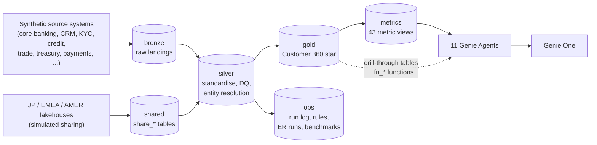
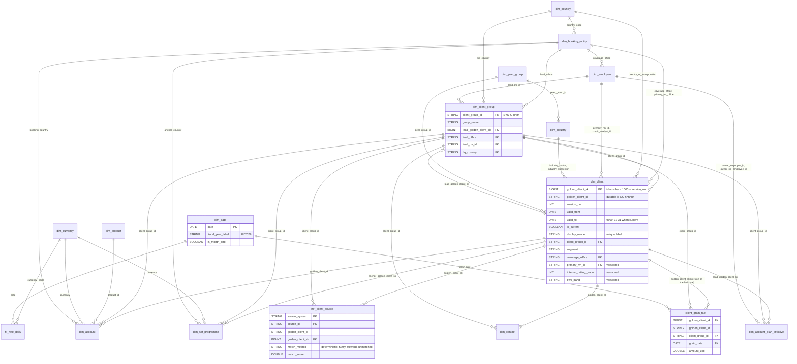

# Data model — SMBC APAC Customer 360 (synthetic)

This page describes the data behind the 11 Genie Agents: the layers of catalog `smbc_genie`, the gold Customer
360 hub, the facts by business domain, the metric-view bases, `vw_client_360`, the conventions every table
follows, and which metric views each agent uses. All data is **synthetic**: no real SMBC clients, people or
figures. "Today" is 30 Sep 2026, the close of H1 FY2026.

Sources: the gold specs (`src/30_gold/specs/*.yaml`, one per object), `information_schema` of the live catalog
(read on 4 Oct 2026) and [DATA_ASSET_REPORT.md](DATA_ASSET_REPORT.md) for row counts. Every gold table and column
carries a comment in Unity Catalog, so `DESCRIBE TABLE EXTENDED smbc_genie.gold.<table>` explains any column. The
measure definitions are in [metrics/_glossary.md](../metrics/_glossary.md).

## 1. Layers and schemas



| Schema | Role | Objects | Rows | Notes |
|---|---|---|---|---|
| `bronze` | Raw landings per simulated source system: mostly STRING columns, ingestion metadata (`_ingest_ts`, `_batch_id`, `_source_system`, `_source_file`), deliberate data-quality noise and fragmented client identities | 81 tables | 4,693,465 | Table comments only |
| `shared` | Tables as they would arrive by OpenSharing (formerly Delta Sharing) from the Tokyo head office (JP), EMEA and AMER lakehouses: group master, parent exposure, revenue, financials, ratings, support letters | 11 tables | 178,546 | Simulated in this workspace (D27, D41): a real share needs a second workspace in another region |
| `silver` | Cleaned, typed, de-duplicated, conformed data; entity resolution; data-quality results | 98 tables | 5,917,335 | 100% of columns commented |
| `gold` | The Customer 360 star schema: the hub, 64 facts, 8 metric-view bases, `vw_client_360`, 40 SQL functions | 93 tables + 1 view | 7,983,952 | 93 primary keys, 385 foreign keys, 0 orphan rows, 100% of columns commented |
| `metrics` | Unity Catalog metric views (`mv_*`), the main answer surface of the agents | 43 metric views | — | Every measure answers a `MEASURE()` query (report §7) |
| `ops` | Build run log, build config, DQ rule catalogue, ER run quality, storyline assertions, Genie benchmarks, and the `synthetic_*` truth tables the generator used | 25 tables | 181,031 | Gold never reads the truth tables (D45) |
| `default` | Created automatically with the catalog | 0 | — | Empty |

Counts: [DATA_ASSET_REPORT.md §1](DATA_ASSET_REPORT.md) and `information_schema` on 4 Oct 2026. The agents read
only `gold` and `metrics`.

## 2. Conventions

| Topic | Rule |
|---|---|
| Client keys | `golden_client_id` (`GC-nnnnnn`) is the **durable** client key. Entity resolution issues it, and it survives re-runs: when clusters merge, the oldest id wins. `golden_client_sk` (BIGINT) is the key of one **SCD2 version** of the client: numeric part of the id × 1000 + `version_no`. Example: Meridian Agri Holdings (Singapore) Pte Ltd is `GC-002413`; its current version 3 is `golden_client_sk` 2413003. |
| Versions (SCD2, D11) | A version covers whole calendar months: `valid_from` is the 1st of a month, `valid_to` a month-end, the current version ends 9999-12-31 with `is_current = true`. A new version starts when a month-end state changes: primary RM, internal rating grade, IFRS 9 stage, external rating, EWS band, watchlist flag, KYC risk rating, next KYC review date or account-plan flag. Identity, segment, tier, industry and coverage office never change between versions (a spec check). `dim_client` holds 10,483 versions for 2,552 golden clients, about 4.1 per client. |
| As-was joins | Every client-grain fact carries both keys: the `golden_client_sk` of the version valid on the fact date, and the `golden_client_id`. Join on the sk to see the client as it was on that date (for example its rating then); filter `dim_client.is_current` on the id for today's view. The join pattern is in `src/30_gold/README.md`. |
| Group keys (D12) | `client_group_id` (`SYN-G-nnnn`, 380 groups) on every client fact. Group-grain facts carry `client_group_id` and `lead_golden_client_sk`, the current version of the group's lead entity. |
| Dates | Date keys are DATE columns with a foreign key to `dim_date` (1 Apr 2023 – 31 Mar 2027, 1,461 days). Only the grain date has the foreign key. |
| Fiscal year | Japanese fiscal year, April to March: FY2026 = Apr 2026 – Mar 2027; Q1 Apr–Jun, Q2 Jul–Sep, Q3 Oct–Dec, Q4 Jan–Mar; H1 Apr–Sep, H2 Oct–Mar (D17). Financial statements keep each client's own year-end. |
| As-of date | Today = 30 Sep 2026. Nothing uses `CURRENT_DATE()`; `smbc_genie.gold.fn_as_of_date()` returns the date and `dim_date` has as-of flags (D16). |
| Currency | Every amount has a USD column (`<x>_usd`). Local amounts are `<x>_lcy` with an ISO `currency` column. `fx_rate_daily` is dense by currency and day; `fn_usd(amount, currency, date)` converts. |
| Point-in-time vs flow | Balances, exposure, limits, RWA, ECL, scores and "as at" counts are snapshots: never add them across months. Flows (revenue, payments, issuance) add up. The metric views encode this as window measures (D32). |
| Multi-grain bases (D13) | Where one view needs several grains, gold builds a `record_type` union (`mvb_*`, section 5); each amount sits only on the row type that owns it, so sums never double count. |
| Constraints | Primary keys are `NOT NULL` and `RELY`; foreign keys are `NOT ENFORCED RELY`. The audit found 0 orphan rows (report §3). The foreign keys also give Genie its join hints. |
| Comments and tags | 100% of gold and metrics columns have comments, generated from one column dictionary (D25). Tags use the `smbc_` prefix (`smbc_layer`, `smbc_domain`, `smbc_synthetic`) because the account governs the plain `domain` key (D37). |
| Thresholds | One table, `dim_threshold` (D20, D29): RoRWA hurdle 1.2%, RAROC hurdle 12%, ROE hurdle 10%, the USD 500m single-borrower attention threshold, EWS bands (Green < 40, Amber 40–69, Red ≥ 70), stage SLAs. |
| Synthetic ids | Fictional names, `SYN…` group ids, `SYNLEI…` LEI-like ids; names were checked against a real-company blocklist (D23). |
| Rows without a client | By design some rows have no golden client: applicants that never went live, prospect screenings, market-residual corridor rows, non-APAC entities. The 9 tables with such rows are listed in report §3. |

## 3. The gold hub

The hub is the set of shared dimensions every fact joins to: 21 tables and one function.

| Table | Key | Rows | What it holds |
|---|---|---|---|
| `dim_client` | `golden_client_sk` (version); `golden_client_id` (durable) | 10,483 versions, 2,552 current | The golden client: one legal entity resolved across 7 identity sources (ENTITY_RESOLUTION.md). Names (`legal_name`, `display_name` unique among current clients, `short_name`, `aliases_text`), LEI-like id, country, group, segment, tier, industry, coverage office, primary RM, credit analyst, rating, IFRS 9 stage, external rating, EWS band, watchlist, KYC risk, source coverage and `golden_record_confidence`. 54 columns. |
| `dim_client_group` | `client_group_id` | 380 | Client groups (global parents) as of 30 Sep 2026: the Tokyo head-office group master plus the APAC roll-up (lead entity, lead office, lead RM, worst rating, worst EWS band, watchlist count), the group's external rating, the JP parent's rating from the Japan share, entity counts in APAC / EMEA / AMER. |
| `xref_client_source` | (`source_system`, `source_id`) | 9,270 | Every source identity record with its golden client from the latest ER run: how it matched, the score, the steward decision, the name and country as the source recorded them. |
| `dim_contact` | `contact_id` | 6,000 | Client contacts recorded in CRM (fictional people): role, seniority, relationship strength, last RM interaction. |
| `dim_account` | `account_id` | 7,804 | Core-banking deposit accounts: product, CASA or time deposit, currency, booking country, open date. |
| `dim_account_plan_initiative` | `initiative_id` | 500 | Account-plan initiatives per group and fiscal year (a detail dimension, D15). |
| `dim_date` | `date` | 1,461 | Calendar with Japanese fiscal fields and flags relative to 30 Sep 2026. |
| `dim_booking_entity` | `booking_entity_id` | 16 | The 13 APAC booking locations (Singapore hub plus HK, CN, TH, ID, IN, AU, VN, MY, TW, KR, PH, NZ) and the provider regions JP, EMEA and AMER. A client's coverage office is one of these. |
| `dim_country` | `country_code` | 69 | ISO-2 countries with region (APAC, JP, EMEA, AMER). |
| `dim_currency` | `currency_code` | 17 | USD, the 13 APAC local currencies, JPY, EUR, GBP. |
| `fx_rate_daily` | (`currency_code`, `date`) | 24,837 | Daily rate to USD for every currency and day; a missing day carries the last rate forward. |
| `dim_product` | `product_id` | 43 | Business line → product family → product, plus the CRM sales products. |
| `dim_employee` | `employee_id` | 245 | Fictional staff: RMs (RM001–RM120), credit analysts and approvers, TB sales, onboarding officers. |
| `dim_industry` | (`industry_sector`, `industry_subsector`) | 48 | Industry taxonomy with peer group, carbon-intensive flag and sector limit. |
| `dim_peer_group` | `peer_group_id` | 48 | Peer groups for ratio benchmarking, one per subsector. |
| `dim_signal_type` | `signal_code` | 42 | Every signal code: CRM opportunity signals, EWS triggers, derived news / market / rating / RM-note signals. |
| `dim_ews_trigger` | `trigger_code` | 13 | The early-warning rule book: category, severity, threshold, score points, watchlist trigger. |
| `dim_onboarding_stage` | `stage_no` | 7 | Onboarding stages Request → KYC Docs → Screening → Risk Assessment → Credit/Product Approval → Account Open → First Transaction, with SLA days. |
| `dim_threshold` | `threshold_code` | 40 | Business thresholds (section 2). |
| `dim_competitor_bank` | `bank_id` | 10 | SMBC and the fictional competitor banks seen in payments and wallet estimates. |
| `dim_scf_programme` | `programme_id` | 8 | Supply-chain-finance programmes with their anchor client. |
| `fn_usd` | function | — | `fn_usd(amount, currency, date)`: local currency to USD at the `fx_rate_daily` rate of that date. |

How often the facts point at each hub table (foreign keys in `information_schema`, 4 Oct 2026, 385 in total):
`dim_client` 74, `dim_date` 73, `dim_client_group` 72, `dim_booking_entity` 40, `dim_employee` 30, `dim_product`
29, `dim_currency` 18, `dim_country` 16, `dim_peer_group` 7, `dim_account` 5, `dim_ews_trigger` 4,
`dim_signal_type` 3, `dim_competitor_bank` 3, `fact_trade_finance_transaction` 3, `dim_onboarding_stage` 2,
`dim_contact` 2, `dim_industry` 2, `dim_scf_programme` 2.

### ER diagram of the hub

The relationships are the declared foreign keys among the hub tables (`information_schema`, 4 Oct 2026).
`client_grain_fact` stands for any of the client-grain facts. `dim_signal_type`, `dim_ews_trigger`,
`dim_onboarding_stage`, `dim_competitor_bank` and `dim_threshold` are referenced by facts only and are left out to
keep the diagram readable.



## 4. Facts by domain

64 facts in 11 business domains, plus the 8 metric-view bases of section 5. "Feeds" names the metric view that
reads the table directly (`metrics/*.yaml`, `source:`), or the base or view that consumes it.

**Relationship management (Account Planning)**

| Fact | Grain | Rows | Feeds |
|---|---|---|---|
| `fact_account_plan_annual` | client group × fiscal year × product family | 8,723 | `mv_account_plan_progress` |
| `fact_product_holding_monthly` | golden client × product × month (dense from first use) | 496,037 | `mv_relationship_footprint` |
| `fact_group_global_exposure_monthly` | entity × region (APAC, JP, EMEA, AMER) × product family × month-end | 375,146 | `mv_global_group_relationship` |
| `fact_client_coverage_monthly` | golden client × month-end | 72,790 | `mvb_rm_engagement` |
| `fact_rm_activity` | CRM activity | 6,000 | `mvb_rm_engagement` |
| `fact_wallet_estimate_annual` | client group × fiscal year × product family | 7,622 | no view (the account-plan fact carries the wallet columns) |

**Opportunity**

| Fact | Grain | Rows | Feeds |
|---|---|---|---|
| `fact_opportunity_signal` | opportunity signal | 4,500 | `mv_opportunity_signals` |
| `fact_next_best_product_score` | golden client × product × score month | 18,333 | `mv_next_best_product` |
| `fact_pipeline_opportunity` | pipeline opportunity | 1,329 | `mv_pipeline` |
| `fact_client_product_penetration_annual` | golden client × core product × fiscal year (dense) | 240,426 | `mv_product_penetration` |
| `fact_peer_penetration_annual` | peer group × core product × fiscal year | 5,328 | no view (the penetration fact carries the peer columns) |

**Credit (credit memo pack)**

| Fact | Grain | Rows | Feeds |
|---|---|---|---|
| `fact_financial_statement_annual` | credit obligor × fiscal year × statement line (long format) | 72,819 | `mv_financial_spreads` |
| `fact_financial_ratio_annual` | credit obligor × fiscal year × ratio, with peer percentiles | 45,849 | `mv_financial_ratios_vs_peers` |
| `fact_peer_benchmark_annual` | peer group × ratio × fiscal year | 2,400 | no view (the ratio fact carries P25 / median / P75) |
| `fact_facility_terms` | credit facility, terms as of 30 Sep 2026 | 1,505 | `mvb_facility_risk` |
| `fact_covenant_test` | facility × covenant × test date | 8,003 | `mvb_facility_risk`, `vw_client_360` |
| `fact_collateral` | collateral item | 1,223 | `mvb_facility_risk` |
| `fact_credit_review_workflow` | credit review or spreading task | 5,596 | `mv_credit_review_workflow` |

**Early warning**

| Fact | Grain | Rows | Feeds |
|---|---|---|---|
| `fact_ews_score_daily` | golden client × day (1 Apr 2025 – 30 Sep 2026) | 491,008 | `mv_ews_scores` |
| `fact_ews_signal_daily` | golden client × evaluation month-end × trigger | 11,596 | `mv_ews_signals` |
| `fact_credit_exposure_monthly` | facility × month-end: limit, drawn, EAD, RWA, ECL, DPD bucket | 30,542 | `mv_delinquency`, `mvb_watchlist` |
| `fact_watchlist_event` | watchlist event | 976 | `mvb_watchlist` |
| `fact_dpd_daily` | facility × day in arrears | 5,584 | no view (DPD buckets are in the exposure fact) |
| `fact_rating_migration` | internal rating event | 2,644 | no view (the signal fact carries the downgrade flags) |

**Profitability**

| Fact | Grain | Rows | Feeds |
|---|---|---|---|
| `fact_client_revenue_monthly` | golden client × month × product family: revenue, cost, credit cost, RWA, capital | 198,961 | `mv_client_profitability` |
| `fact_client_pnl_waterfall_annual` | golden client × fiscal year (FY2026 to date) | 6,389 | `mv_roe_waterfall` |
| `fact_deal_pricing` | credit deal signed since FY2023 | 727 | `mv_deal_pricing` |
| `fact_capital_allocation_monthly` | golden client × month | 17,371 | no view (the revenue fact carries RWA and capital) |
| `fact_cost_allocation_monthly` | golden client × month × product family | 174,323 | no view (the revenue fact carries the cost lines) |

**Onboarding and KYC**

| Fact | Grain | Rows | Feeds |
|---|---|---|---|
| `fact_onboarding_case` | onboarding case | 358 | `mvb_onboarding`, `vw_client_360` |
| `fact_onboarding_stage_event` | case × stage | 2,099 | `mv_onboarding_cycle_time` |
| `fact_kyc_document` | document requested in a case | 2,984 | `mvb_onboarding` |
| `fact_onboarding_feedback` | survey response | 153 | `mvb_onboarding` |
| `fact_kyc_review` | KYC review | 3,072 | `vw_client_360`, `fn_kyc_overdue_reviews` |
| `fact_kyc_review_snapshot_monthly` | review × month-end with activity | 4,502 | `mvb_kyc_health` |
| `fact_screening` | screening alert | 15,339 | `mvb_kyc_health` |

**Transaction banking: cash, payments, liquidity**

| Fact | Grain | Rows | Feeds |
|---|---|---|---|
| `fact_deposit_balance_monthly` | account × month-end | 246,544 | `mv_tb_deposits`, `mvb_group_liquidity` |
| `fact_deposit_balance_daily` | account × day (1 Dec 2025 – 30 Sep 2026) | 2,281,813 | no view (used in reconciliations) |
| `fact_payment_transaction` | payment message, after the replay de-duplication | 179,818 | `mv_tb_payments` |
| `fact_liquidity_structure_monthly` | structure × member account × month-end | 4,057 | `mvb_group_liquidity` |
| `fact_channel_usage_monthly` | golden client × channel × month | 135,353 | `mv_tb_channel_adoption` |
| `fact_tb_fee_income_monthly` | fee line (client × month × fee type × product × country × currency) | 261,440 | no view (revenue by product family is in `fact_client_revenue_monthly`) |
| `fact_fx_deal` | FX deal | 60,000 | no view (FX revenue is a product family in `fact_client_revenue_monthly`) |

**Trade and supply chain finance**

| Fact | Grain | Rows | Feeds |
|---|---|---|---|
| `fact_trade_finance_transaction` | trade-finance instrument | 20,978 | `mvb_trade_finance` |
| `fact_trade_outstanding_monthly` | instrument × month-end while outstanding | 105,298 | `mvb_trade_finance` |
| `fact_trade_document_check` | LC document presentation | 10,219 | `mv_trade_operations` |
| `fact_scf_programme_monthly` | programme × month-end × record (programme or supplier) | 10,657 | `mv_tb_scf` |
| `fact_scf_programme_drawdown` | SCF invoice | 29,766 | `fact_scf_programme_monthly` |
| `fact_trade_corridor_monthly` | corridor × HS chapter × month × client, plus market-residual rows | 108,672 | `mv_trade_corridors` |

**Cash-flow forecasting**

| Fact | Grain | Rows | Feeds |
|---|---|---|---|
| `fact_client_cashflow_daily` | golden client × date × cash-flow category | 825,256 | `mv_client_cashflow` |
| `fact_cashflow_forecast` | golden client × forecast date × horizon × model version | 36,288 | `mv_cashflow_forecast` |
| `fact_forecast_accuracy_monthly` | golden client × target month × horizon × model version | 30,909 | `mv_forecast_accuracy` |
| `fact_liquidity_need_event` | predicted shortfall or surplus | 329 | `mv_liquidity_events` |

**Signals and sentiment**

| Fact | Grain | Rows | Feeds |
|---|---|---|---|
| `fact_news_item` | news item (fictional vendor, synthetic text) | 3,063 | `mv_news_sentiment` |
| `fact_rm_note_sentiment` | RM call note | 6,000 | `mv_internal_sentiment` |
| `fact_market_signal_daily` | listed parent × trading day | 86,240 | `mv_market_signals` |
| `fact_signal_event` | signal from any source, keyed to `dim_signal_type` | 24,266 | `mv_signal_feed` |

**Data foundation**

| Fact | Grain | Rows | Feeds |
|---|---|---|---|
| `fact_entity_resolution_run` | ER run × source system, plus an ALL row per run | 48 | `mvb_entity_resolution` |
| `fact_steward_queue` | steward review item | 2,108 | `mvb_entity_resolution` |
| `fact_group_exposure_by_er_run` | ER run × client group, plus an unattributed row | 1,959 | `mv_er_exposure_impact` |
| `fact_golden_record_coverage_monthly` | golden client × month × identity source | 749,210 | `mv_golden_record_coverage` |
| `fact_dq_score_monthly` | month × table × DQ dimension | 26,632 | `mv_data_quality` |
| `fact_dq_rule_result` | DQ run × rule × layer | 941 | `mv_data_quality` |
| `fact_delta_share_freshness_daily` | day × shared table | 10,043 | `mv_delta_sharing_freshness` |

Ten facts feed no metric view, base or agent asset (the rows marked "no view"), so the agents cannot query them.
In most cases another fact carries the columns the questions need, as noted; otherwise the table is there for
direct SQL and for reconciliation. `fact_scf_programme_drawdown` reaches the agents through
`fact_scf_programme_monthly`, and `fact_kyc_review` through `vw_client_360` and `fn_kyc_overdue_reviews`.

## 5. Metric-view bases (`mvb_*`)

A metric view reads one source. When a question mixes grains (a facility and its covenant tests, a case and its
documents), gold unions the grains into one base with a `record_type` column (D13). Each amount or flag is filled
only on the row type that owns it and is null elsewhere, so `SUM`, `MIN` and `COUNT_IF` never double count.
Record counts below were read on 4 Oct 2026.

| Base | Record types (rows) | Built from | Metric view |
|---|---|---|---|
| `mvb_facility_risk` | Facility (1,505), Covenant Test (8,003), Collateral (1,223) | `fact_facility_terms`, `fact_covenant_test`, `fact_collateral` | `mv_facilities_covenants_collateral` |
| `mvb_watchlist` | Event (976), Month-End Membership (2,388) | `fact_watchlist_event`, `fact_ews_score_daily`, `fact_credit_exposure_monthly` | `mv_watchlist` |
| `mvb_onboarding` | Case (358), Product Request (817), Document (2,984), Feedback (153) | `fact_onboarding_case`, `fact_kyc_document`, `fact_onboarding_feedback` | `mv_onboarding_funnel` |
| `mvb_kyc_health` | Review Snapshot (4,502), Screening (15,339) | `fact_kyc_review_snapshot_monthly`, `fact_screening` | `mv_kyc_health` |
| `mvb_rm_engagement` | activity (6,000), coverage (72,790) | `fact_rm_activity`, `fact_client_coverage_monthly` | `mv_rm_engagement` |
| `mvb_trade_finance` | Issuance (20,978), Outstanding (105,298) | `fact_trade_finance_transaction`, `fact_trade_outstanding_monthly` | `mv_tb_trade_finance` |
| `mvb_group_liquidity` | Structure member (4,057), Group (15,471) | `fact_liquidity_structure_monthly`, `fact_deposit_balance_monthly` | `mv_tb_liquidity_structures` |
| `mvb_entity_resolution` | source_record (54,897), run_source (48), steward_item (2,108) | `fact_entity_resolution_run`, `fact_steward_queue`, `dim_client` | `mv_entity_resolution` |

Some bases mark one primary row per business object (`is_primary_row`) for counts, for example one Facility row
per facility.

## 6. `vw_client_360`

`smbc_genie.gold.vw_client_360` is a view with **one row per current golden client** (2,552 rows, 126 columns).
It is the drill-through table in all 11 agents; each agent exposes only the columns it needs (`include_columns`
in its `space.yaml`). It joins `dim_client` and `dim_client_group` with the latest value from 20 facts.

| Column group | Examples |
|---|---|
| Identity and names | `golden_client_id`, `display_name`, `legal_name`, `short_name`, `aliases_text` (for `LIKE` searches), `lei_like_id` |
| Group | `client_group_id`, `group_name`, `is_group_lead`, `jp_parent_legal_name`, `jp_parent_rating_equivalent` |
| Classification and coverage | `segment`, `relationship_tier`, `industry_sector`, `coverage_office`, `primary_rm_name` |
| Risk | `internal_rating_grade`, `ifrs9_stage`, `external_rating`, `ews_band`, `ews_score`, `watchlist_flag`, `covenant_min_headroom_pct`, `max_days_past_due` |
| Profitability and products | `revenue_fytd_usd`, `revenue_yoy_pct`, `rorwa_latest_quarter`, `below_rorwa_hurdle`, `products_held_count`, `next_best_product` |
| Pipeline and RM contact | `open_pipeline_usd`, `won_fytd_usd`, `last_rm_contact_date`, `rm_contacts_last_90d` |
| Credit exposure | `credit_limit_usd`, `drawn_usd`, `utilisation_pct`, `ead_usd`, `rwa_usd`, `ecl_usd` |
| KYC and onboarding | `kyc_risk_rating`, `overdue_kyc_reviews`, `latest_onboarding_status`, `latest_onboarding_match_timing` |
| Transaction banking | `deposits_usd`, `casa_ratio`, `td_maturing_90d_usd`, `payments_last_90d_usd`, `trade_outstanding_usd` |
| Cash flow | `forecast_net_30d_usd` (with P10 / P90), `latest_liquidity_event_type` |
| Signals and sentiment | `signals_last_90d`, `news_sentiment_last_90d`, `rm_note_sentiment_last_90d`, `is_blind_spot_group` |
| Data foundation | `source_systems_text`, `n_source_records`, `golden_record_confidence`, `attribute_completeness_pct` |

Point-in-time columns are at the 30 Sep 2026 month-end or day; FYTD means 1 Apr – 30 Sep 2026 (H1 FY2026);
amounts are USD; ratios are fractions (0.25 = 25%); 0 means none.

## 7. Metric views per agent

The 43 metric views live in `smbc_genie.metrics`, one YAML file each in `metrics/`. Every view carries the same
**client block** (Client Group, Client, Segment, Relationship Tier, Is Japanese Corporate, Industry, Subsector,
Coverage Office, Primary RM, Primary RM Office, Rating Grade, IFRS 9 Stage, Watchlist, KYC Risk Rating, EWS
Band), taken from the client's version on the row's date, and the same **calendar block** (Date or Month, Fiscal
Year, Fiscal Quarter, Fiscal Half, Is Month End, Is Latest Month; annual views use the fiscal-year fields).
Definitions, units and caveats of every field and measure: [metrics/_glossary.md](../metrics/_glossary.md).

| Agent | Metric views (gold source) | Drill-through tables | SQL functions |
|---|---|---|---|
| Account Planning | `mv_account_plan_progress` (`fact_account_plan_annual`), `mv_relationship_footprint` (`fact_product_holding_monthly`), `mv_global_group_relationship` (`fact_group_global_exposure_monthly`), `mv_rm_engagement` (`mvb_rm_engagement`) | `dim_account_plan_initiative`, `dim_client_group`, `vw_client_360` | `fn_account_plan_status`, `fn_account_plan_footprint`, `fn_account_plan_rm_book` |
| Opportunity Identification | `mv_opportunity_signals` (`fact_opportunity_signal`), `mv_next_best_product` (`fact_next_best_product_score`), `mv_pipeline` (`fact_pipeline_opportunity`), `mv_product_penetration` (`fact_client_product_penetration_annual`) | `dim_signal_type`, `dim_client_group`, `vw_client_360` | `fn_opportunity_top_open_signals`, `fn_opportunity_fx_leakage`, `fn_opportunity_penetration_gaps` |
| Credit Memo & Financial Spreading | `mv_financial_spreads` (`fact_financial_statement_annual`), `mv_financial_ratios_vs_peers` (`fact_financial_ratio_annual`), `mv_facilities_covenants_collateral` (`mvb_facility_risk`), `mv_credit_review_workflow` (`fact_credit_review_workflow`) | `vw_client_360`, `dim_client_group`, `dim_peer_group` | `fn_credit_memo_financials`, `fn_credit_memo_facilities`, `fn_credit_memo_exposure` |
| Early Warning Monitoring | `mv_ews_scores` (`fact_ews_score_daily`), `mv_ews_signals` (`fact_ews_signal_daily`), `mv_watchlist` (`mvb_watchlist`), `mv_delinquency` (`fact_credit_exposure_monthly`) | `dim_ews_trigger`, `vw_client_360`, `dim_client_group` | `fn_ews_timeline`, `fn_ews_client_snapshot`, `fn_watchlist_overdue_actions` |
| Client Profitability & ROE | `mv_client_profitability` (`fact_client_revenue_monthly`), `mv_roe_waterfall` (`fact_client_pnl_waterfall_annual`), `mv_deal_pricing` (`fact_deal_pricing`), and `mv_next_best_product` from Opportunity Identification | `dim_threshold`, `dim_client_group`, `vw_client_360` | `fn_profitability_below_hurdle_lending`, `fn_profitability_deal_exceptions`, `fn_profitability_rm_summary` |
| Client Onboarding & KYC | `mv_onboarding_funnel` (`mvb_onboarding`), `mv_onboarding_cycle_time` (`fact_onboarding_stage_event`), `mv_kyc_health` (`mvb_kyc_health`) | `vw_client_360`, `dim_client_group`, `dim_onboarding_stage` | `fn_onboarding_open_cases`, `fn_kyc_overdue_reviews` |
| TB: Cash, Payments & Liquidity | `mv_tb_deposits` (`fact_deposit_balance_monthly`), `mv_tb_payments` (`fact_payment_transaction`), `mv_tb_liquidity_structures` (`mvb_group_liquidity`), `mv_tb_channel_adoption` (`fact_channel_usage_monthly`) | `vw_client_360`, `dim_client_group` | `fn_casa_movement_by_country`, `fn_tb_payment_drop_steady_deposits`, `fn_tb_group_cash_profile` |
| TB: Trade & Supply Chain Finance | `mv_tb_trade_finance` (`mvb_trade_finance`), `mv_trade_operations` (`fact_trade_document_check`), `mv_tb_scf` (`fact_scf_programme_monthly`), `mv_trade_corridors` (`fact_trade_corridor_monthly`), and `mv_tb_payments` from TB Cash | `dim_scf_programme`, `vw_client_360`, `dim_client_group` | `fn_scf_anchor_candidates`, `fn_trade_corridor_growth`, `fn_trade_group_profile` |
| Cashflow Forecasting | `mv_cashflow_forecast` (`fact_cashflow_forecast`), `mv_forecast_accuracy` (`fact_forecast_accuracy_monthly`), `mv_liquidity_events` (`fact_liquidity_need_event`), `mv_client_cashflow` (`fact_client_cashflow_daily`) | `vw_client_360`, `dim_client_group` | `fn_cashflow_forecast_by_entity`, `fn_cashflow_shortfalls_with_rcf`, `fn_cashflow_group_liquidity` |
| Signals & Sentiment | `mv_news_sentiment` (`fact_news_item`), `mv_internal_sentiment` (`fact_rm_note_sentiment`), `mv_market_signals` (`fact_market_signal_daily`), `mv_signal_feed` (`fact_signal_event`) | `dim_signal_type`, `dim_client_group`, `vw_client_360` | `fn_group_signal_digest`, `fn_group_sentiment_snapshot`, `fn_sentiment_blind_spots`, `fn_as_of_date` |
| Customer 360 Data Foundation | `mv_entity_resolution` (`mvb_entity_resolution`), `mv_golden_record_coverage` (`fact_golden_record_coverage_monthly`), `mv_data_quality` (`fact_dq_score_monthly` + `fact_dq_rule_result`), `mv_delta_sharing_freshness` (`fact_delta_share_freshness_daily`), `mv_er_exposure_impact` (`fact_group_exposure_by_er_run`) | `xref_client_source`, `vw_client_360`, `dim_client_group` | `fn_er_run_summary`, `fn_er_exposure_changes`, `fn_dq_score_changes`, `fn_as_of_date` |

The functions are Unity Catalog SQL table functions in `smbc_genie.gold`, defined per agent in
`genie/<slug>/functions.sql`; `fn_as_of_date` is a shared helper. Gold holds 40 functions in all: the 32 agent
functions, 7 calendar helpers (`fn_as_of_date`, `fn_fiscal_year`, `fn_fiscal_year_label`, `fn_fiscal_quarter`,
`fn_fiscal_half`, `fn_fiscal_month_no`, `fn_latest_closed_month`) and `fn_usd`.

## 8. Exploring the model

```sql
-- every gold table with its comment
SELECT table_name, comment FROM smbc_genie.information_schema.tables WHERE table_schema = 'gold' ORDER BY 1;

-- the columns and comments of one table
DESCRIBE TABLE EXTENDED smbc_genie.gold.dim_client;

-- the foreign keys of one table
SELECT f.column_name, p.table_name AS references_table
FROM smbc_genie.information_schema.referential_constraints rc
JOIN smbc_genie.information_schema.key_column_usage f
  ON f.constraint_schema = rc.constraint_schema AND f.constraint_name = rc.constraint_name
JOIN smbc_genie.information_schema.key_column_usage p
  ON p.constraint_schema = rc.unique_constraint_schema AND p.constraint_name = rc.unique_constraint_name
 AND p.ordinal_position = f.position_in_unique_constraint
WHERE f.table_name = 'fact_deposit_balance_monthly';

-- a client as it was on each fact date (SCD2 as-was) versus today
SELECT f.balance_date, v.internal_rating_grade AS grade_then, c.internal_rating_grade AS grade_today,
       sum(f.balance_usd) AS deposits_usd
FROM smbc_genie.gold.fact_deposit_balance_monthly f
JOIN smbc_genie.gold.dim_client v ON v.golden_client_sk = f.golden_client_sk
JOIN smbc_genie.gold.dim_client c ON c.golden_client_id = f.golden_client_id AND c.is_current
WHERE c.display_name LIKE '%Sunda Energi Nusantara (Jakarta)%'
GROUP BY ALL ORDER BY 1;
```

On 4 Oct 2026 the last query returned 42 month-ends. `grade_then` is 7 up to May 2026 and 9 from June 2026 (the
downgrade of storyline 1), while `grade_today` is 9 on every row: the same deposits, seen as they were and as
they are.

To change the model, edit `src/30_gold/specs/<table>.yaml` and `src/30_gold/sql/<table>.sql` and rebuild with
`.venv/bin/python src/30_gold/run_gold.py --profile my-workspace --only <table>`; the gold README
(`src/30_gold/README.md`) explains the spec format and the gates.
