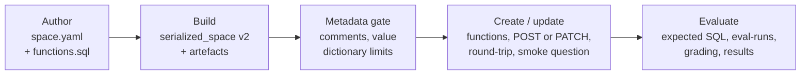

# Genie Agents runbook — SMBC APAC Genie

How the 11 Genie Agents of this demo are built, changed, evaluated, fixed and (when the owner decides) shared.
Written for solution architects and the demo owner. All data is **synthetic**: no real SMBC clients, people or
figures.

Terms used on this page:

- **Genie Agent**: formerly a Genie space (renamed 8 Jul 2026), "a domain-specific natural-language chat
  interface … where users ask questions of their data and get back SQL queries, results tables, and
  visualizations" ([docs](https://docs.databricks.com/aws/en/genie-agents)). The REST paths still say
  `genie/spaces`, and so do our file names (`genie/<slug>/space.yaml`, `space_id`).
- **Genie One**: the simplified Databricks UI for business users (formerly Databricks One), at `/one`. Its chat
  first looks for a matching Genie Agent ([docs](https://docs.databricks.com/aws/en/genie-one/chat)).
- **Metric view**: a Unity Catalog view that defines business measures once, in YAML, queried with `MEASURE()`.
  The agents answer mostly from the 43 metric views in `smbc_genie.metrics` ([DATA_MODEL.md](DATA_MODEL.md)).
- **Trusted assets**: the example SQL queries and SQL functions an agent can reuse as they are.
- **Benchmark**: a test question with an expected SQL answer. An evaluation asks Genie every benchmark and
  compares its result with the expected result.

Related pages: [TEARDOWN.md](TEARDOWN.md), [DATA_MODEL.md](DATA_MODEL.md),
[ENTITY_RESOLUTION.md](ENTITY_RESOLUTION.md), [genie/README.md](../genie/README.md) (authoring format in full),
[DATA_ASSET_REPORT.md](DATA_ASSET_REPORT.md) (the audit), [DECISIONS.md](DECISIONS.md).

## 1. The agents at a glance

| Item | Value |
|---|---|
| Workspace | `my-workspace`, https://my-workspace.cloud.databricks.com (serverless only) |
| CLI profile | `my-workspace` |
| SQL warehouse | `my-warehouse-id` (also used by other demos) |
| Catalog | `smbc_genie`; the agents read only `gold` and `metrics` |
| "Today" in the data | 30 Sep 2026, the close of H1 FY2026. Japanese fiscal year: FY2026 = Apr 2026 – Mar 2027 |
| Agent URL | `https://my-workspace.cloud.databricks.com/genie/rooms/<id>` |
| Genie One | `https://my-workspace.cloud.databricks.com/one` |

| # | Agent | Slug (`genie/<slug>/`) | Id | Tier (brief §5) | Benchmarks passed |
|---|---|---|---|---|---|
| 1 | APAC Genie - Account Planning | account_planning | my-agent-id | RM Workbench | 18/18 |
| 2 | APAC Genie - Opportunity Identification | opportunity_identification | my-agent-id | RM Workbench | 18/18 |
| 3 | APAC Genie - Credit Memo & Financial Spreading | credit_memo_financial_spreading | my-agent-id | Credit Workbench | 19/20 ⚠️ |
| 4 | APAC Genie - Early Warning Monitoring | early_warning_monitoring | my-agent-id | Credit Workbench | 20/20 |
| 5 | APAC Genie - Client Profitability & ROE | client_profitability_roe | my-agent-id | RM + Credit | 19/20 ⚠️ |
| 6 | APAC Genie - Client Onboarding & KYC | client_onboarding_kyc | my-agent-id | Others | 20/20 |
| 7 | APAC Genie - Transactional Banking: Cash, Payments & Liquidity | tb_cash_payments_liquidity | my-agent-id | Transactional Banking | 20/20 |
| 8 | APAC Genie - Transactional Banking: Trade & Supply Chain Finance | tb_trade_scf | my-agent-id | Transactional Banking | 19/20 ⚠️ |
| 9 | APAC Genie - Cashflow Forecasting | cashflow_forecasting | my-agent-id | AI-enabled | 20/20 |
| 10 | APAC Genie - Signals & Sentiment | signals_sentiment | my-agent-id | AI-enabled | 20/20 |
| 11 | APAC Genie - Customer 360 Data Foundation | customer360_data_foundation | my-agent-id | Data foundation | 20/20 |
| | **Total** | | | | **213/216 (98.6%)** |

Each agent holds 6–8 assets (its metric views plus drill-through gold tables such as `vw_client_360` and
`dim_client_group`), one text instruction block of at most 20 lines, 6 example SQL queries, 2–4 SQL functions
(`smbc_genie.gold.fn_*`), 8 sample questions and 18–20 benchmarks. The ⚠️ rows are explained in section 6.

**Access today** (permissions read on 4 Oct 2026): only the owner `you@example.com` and the workspace
`admins` group, both CAN MANAGE inherited from the owner's folder. The agents are not shared (D48). Section 10 is
the procedure for when the owner decides to share them.

## 2. How an agent is built



| Step | What happens | Code | Writes |
|---|---|---|---|
| 1. Author | You write the spec: title, description, data sources and column settings, up to 8 domain instruction lines, example SQL, SQL functions, sample questions, benchmarks. Settings shared by all 11 agents (the brief §8 base block, the as-of line, the closing response line, limits) live in `genie/_shared.yaml`. | — | `genie/<slug>/space.yaml`, `functions.sql` |
| 2. Build | YAML becomes the Genie `serialized_space` v2 payload. The builder gives every list item a deterministic 32-hex id from (slug, kind, position), sorts every list as the API requires, writes column settings for every column from the schema snapshot, and assembles the one text block: 10 base lines + 1 as-of line + the domain lines + 1 response line. Expected SQL can come from `metrics/_answers/<slug>.sql`, so a benchmark and its must-answer query never drift apart. | `build_space_specs.py`, `smbc_genie_lib/genie.py` | `space_spec.json`, `instructions.md`, `benchmarks.json`, `<slug>.geniespace.json` |
| 3. Metadata gate | `DESCRIBE` every asset. Every column and measure needs a comment. Every entity-matching column must fit the Genie value dictionary (at most 1,024 distinct values of at most 127 characters). After deployment every listed function must carry a Unity Catalog comment, because Genie sees only the comment, not the body. | `metadata_gate.py` | `genie/_schema/<fqn>.json` |
| 4. Create / update | Deploy `functions.sql` (`CREATE OR REPLACE FUNCTION`, then each `-- test:` probe must return rows). Find our agent: the id in `genie/<slug>/space_id`, else exactly one agent with the exact title. POST a new agent or PATCH the full payload, GET it back and diff, then ask the first sample question as a smoke test. Merge the benchmark catalogue into `ops.genie_benchmarks`. | `create_spaces.py` | `genie/<slug>/space_id`, `ops.genie_benchmarks` |
| 5. Evaluate | Run every expected SQL and its checks, start an eval-run (Beta API; fallback the Conversation API), grade, record. | `run_benchmarks.py` | `eval_report.json`, `eval_history.jsonl`, `ops.genie_benchmarks`, `ops.build_run_log` (phase `p07_genie`) |

`src/50_genie/run_genie.py` runs steps 2 to 5. It touches only agents titled "APAC Genie - …" and has no code
that changes permissions or shares an agent.

## 3. Commands

One-off setup:

```bash
make venv                                    # Python 3.12 venv with the dev dependencies
databricks auth login --host https://my-workspace.cloud.databricks.com --profile my-workspace
make auth-check                              # prints the user the profile logs in as
.venv/bin/python -m pytest tests/unit -q     # offline unit tests (no workspace)
```

The runner:

```bash
P="--profile my-workspace"
.venv/bin/python src/50_genie/run_genie.py --build-only --only <slug>                       # offline: validate + write artefacts
.venv/bin/python src/50_genie/run_genie.py $P --only <slug> --dry-run                        # read-only: gate + diff against the live agent
.venv/bin/python src/50_genie/run_genie.py $P --only <slug> --dry-run --evaluate             # read-only: expected SQL checks only
.venv/bin/python src/50_genie/run_genie.py $P --only <slug> --create                         # functions + PATCH + round-trip + smoke question
.venv/bin/python src/50_genie/run_genie.py $P --only <slug> --evaluate --label "iteration 5" # benchmarks -> results files and ops tables
```

| Flag | What it does |
|---|---|
| (none) | Build + gate (refreshes `genie/_schema`, counts entity-matching values) + write artefacts |
| `--build-only` | Offline build from the committed `_schema` snapshot; no login needed |
| `--dry-run` | No writes at all: build + gate + the content diff against the live agent; with `--evaluate`, the expected SQL checks instead of the diff |
| `--create` | Deploy functions, create or PATCH our agent, GET and diff, smoke question, merge the benchmark catalogue |
| `--evaluate` | Expected SQL checks, eval-run, grading, results to files and `ops` tables |
| `--only a,b` (alias `--spaces`) | Some slugs only; the default is every `genie/*/space.yaml` |
| `--eval-method` | `auto` (eval-runs, else the Conversation API), `eval_runs` or `conversation` |
| `--label` | Free text stored with the evaluation, e.g. "iteration 5" |
| `--no-smoke` | Skip the smoke question after `--create` |
| `--skip-gate` | Report gate problems but continue (development only) |
| `--catalog`, `--warehouse-id` | Override `genie/_shared.yaml` (defaults `smbc_genie`, `my-warehouse-id`) |

Exit codes: 0 ok (and a pass rate of at least 85% with `--evaluate`), 1 gate, create or evaluation problem,
2 spec errors. Other entry points: `build_space_specs.py` (same as `--build-only`), `metadata_gate.py
--snapshot-all` (refresh the snapshot of every gold and metrics object) and `run_benchmarks.py` (same as
`--evaluate`).

Run evaluations **one agent at a time**. Rate limits are per workspace and the client backs off on HTTP 429 and
5xx. An evaluation takes about 8 minutes per agent (average of 27 evaluations in `ops.build_run_log`, range 4.8
to 9.8 minutes).

## 4. Changing an agent safely

The loop for any change:

1. Edit only the authoring files: `genie/<slug>/space.yaml` or `functions.sql` (or `metrics/<view>.yaml` for
   metric-view metadata).
2. `--build-only --only <slug>`, then read the diff of the generated files: `git diff genie/<slug>/`.
3. `--only <slug> --dry-run` shows what the PATCH will change on the live agent.
4. `--only <slug> --create`. Check the line `round-trip GET: identical` and the smoke question.
5. `--only <slug> --evaluate --label "<what you changed>"`. Compare with the previous line of
   `genie/<slug>/eval_history.jsonl`.
6. Keep the change only if no benchmark got worse. Otherwise undo it (below).
7. Commit the authoring and generated files together, including `eval_report.json` and `eval_history.jsonl`.

| To change | Where | Rules that keep it safe |
|---|---|---|
| An instruction | `instructions.domain` in space.yaml | At most 8 lines, each starting with `- `. The base, as-of and response lines come from `genie/_shared.yaml` and apply to all 11 agents; change them only on purpose, then re-create and re-evaluate all 11. Text instructions are the last resort: a domain line can leak into other answers (genie/README.md, "Lessons from the pilot"). |
| An example SQL (trusted asset) | `example_sqls` | 4–6 per agent. Declare every `:parameter`; types STRING, DATE, INTEGER, DECIMAL, DOUBLE or BOOLEAN. Genie reuses a trusted example verbatim and substitutes parameters only, so every filter a question needs must be a parameter (D48). Say in `usage_guidance` what the example is for and what it is not for. |
| A SQL function | `functions.sql` and `sql_functions` | Arguments STRING only; use the arguments only in the outermost query; a `COMMENT` on the function, every parameter and every returned column, with no apostrophes; `-- test:` probe lines. Never `CURRENT_DATE()`: use `DATE'2026-09-30'` or `smbc_genie.gold.fn_as_of_date()`. |
| A benchmark | `benchmarks` | 12–20 per agent. Ids follow list position, so **append** new benchmarks; inserting one shifts the ids of those after it. Keep expected SQL minimal and name the output columns (D30). Prefer `answer: Qn` from `metrics/_answers/<slug>.sql`. A benchmark change changes the score, not the agent. |
| Sample questions | `sample_questions` | 6–8; the agent shows them in list order. |
| Column settings | `data_sources[].columns` | Synonyms (at most 10), entity matching only on low-cardinality labels, `exclude` to hide a column. Never entity matching on client names: there are 2,552 golden clients, above the 1,024-value limit. |
| Metric-view metadata | `metrics/<view>.yaml` | Additive only (comments, display names, up to 10 synonyms). Rebuild with `.venv/bin/python src/40_metrics/run_metrics.py --profile my-workspace --only <view>`, then run `run_genie.py` without `--build-only` so the schema snapshot refreshes, then `--create`. |

When a benchmark fails, fix in this order (PLAN §9): metric-view metadata, then column synonyms or entity
matching, then example SQL, then instruction lines.

**Undo.** `git checkout -- genie/<slug>/space.yaml genie/<slug>/functions.sql`, then `--build-only` and
`--create`. The PATCH sends the full payload, so the agent returns exactly to the committed version; the
round-trip diff confirms it.

**Never**: edit the generated files or `space_id`; touch an agent not titled "APAC Genie - …"; add bronze,
silver, shared or ops objects to an agent; run two evaluations at once; change permissions as part of a
build change (section 10 is a separate, owner-approved step).

## 5. Evaluating and reading the results

How an evaluation grades (genie/README.md, "Comparison rule"):

1. Run every benchmark's expected SQL on the warehouse and apply its checks (`rows`, `min_rows`, `max_rows`,
   `must_contain_columns`, `top_row_contains`).
2. Start an eval-run: `POST /api/2.0/genie/spaces/{id}/eval-runs`, poll until `DONE`, then read each result. The
   API grades each answer `GOOD`, `BAD` or `NEEDS_REVIEW`. It takes about 15 seconds per question. If the API is
   unavailable, the runner asks the questions through the Conversation API, one at a time.
3. `GOOD` passes. Otherwise the runner compares Genie's result with the expected result: the same rows in any
   order, values to 4 significant digits, columns matched by their values (names and order ignored). Extra rows
   fail; extra columns fail unless the benchmark sets `allow_extra_columns`.

| Where | What it holds |
|---|---|
| `genie/<slug>/eval_report.json` | The last evaluation. `summary`: eval id, label, method, eval-run id, benchmarks, passes, pass rate, API counts (GOOD / BAD / NEEDS_REVIEW), expected SQL checks passed, time. `benchmarks[]`: key, question, variant of, expected SQL and its check, API assessment, final verdict, reason, Genie's SQL. |
| `genie/<slug>/eval_history.jsonl` | One summary line per evaluation, appended, so you can see the trend. |
| `smbc_genie.ops.genie_benchmarks` | One row per benchmark: the catalogue (question, expected SQL, checks, variant of) and the last result (`last_eval_pass`, `last_eval_assessment`, `eval_reason`, `genie_sql`, `eval_method`, `eval_run_id`, `space_pass_rate`, `checked_at`). |
| `smbc_genie.ops.build_run_log` | One row per evaluation (phase `p07_genie`, step `evaluate`) with the duration. |

```sql
-- pass rate per agent
SELECT space_slug, count(*) AS benchmarks, count_if(last_eval_pass) AS passed, max(space_pass_rate) AS pass_rate
FROM smbc_genie.ops.genie_benchmarks GROUP BY 1 ORDER BY 1;

-- every failing benchmark, with the reason and the SQL Genie wrote
SELECT space_slug, benchmark_key, question, eval_reason, genie_sql
FROM smbc_genie.ops.genie_benchmarks WHERE NOT last_eval_pass;
```

Reading a `reason`: `BAD ['RESULT_MISSING_COLUMNS', 'LLM_JUDGE_…']; rule: …` is the eval-run assessment and its
reasons, then the comparison-rule detail. `conversation: no SQL (…)` means Genie answered in text only.
`expected SQL failed` means our expected SQL broke, not Genie.

Evaluation history (`genie/<slug>/eval_history.jsonl`, all via eval-runs, 4 Oct 2026):

| Agent | Passes per evaluation, first to last |
|---|---|
| Account Planning | 18/18 |
| Opportunity Identification | 15/18 → 18/18 |
| Credit Memo & Financial Spreading | 17/20 → 17/20 → 18/20 → 19/20 |
| Early Warning Monitoring (the pilot) | 0/20 → 14/20 → 19/20 → 20/20 (every question failed in the first run; genie/README.md traces the pilot's total failure to a DATE function argument, see section 8) |
| Client Profitability & ROE | 15/20 → 19/20 → 19/20 |
| Client Onboarding & KYC | 17/20 → 20/20 |
| TB Cash, Payments & Liquidity | 20/20 |
| TB Trade & SCF | 13/20 → 17/20 → 19/20 → 19/20 |
| Cashflow Forecasting | 20/20 |
| Signals & Sentiment | 18/20 → 20/20 |
| Customer 360 Data Foundation | 17/20 → 18/20 → 20/20 |

## 6. The three questions that sometimes miss

Genie is not deterministic: the same question can produce different SQL on different days. These three
benchmarks failed in the last evaluation. Each has a phrasing variant that passes. The tuning ideas below have
**not** been applied.

| Agent | Benchmark (key) | What Genie did (`eval_report.json`) | Safer wording in a demo | Tuning ideas |
|---|---|---|---|---|
| Credit Memo & Financial Spreading | Q10: "New-money requests approved in H1 FY2026 by coverage office: number approved, requested amount, weighted margin in bps and average days to approval." | Kept the New Money and FY2026-H1 approval filters but dropped `Outcome IN ('Approved', 'Approved with Conditions')`, so the amounts also cover requests that were not approved. The abbreviated variant (Q10-abbrev) passes. | Say "approved outcome", for example "New-money requests with an approved outcome in H1 FY2026 by coverage office: …" | A measure in `mv_credit_review_workflow` for the requested amount of approved requests only; a sentence in the `Requested Amount USD` comment that it covers every outcome; an example SQL for approvals by office with a fiscal-half parameter. |
| Client Profitability & ROE | Q10-abbrev: "HK RM P&L by RM - FYTD rev, avg RWA, RoRWA, clients" | Read the annual waterfall view (`mv_roe_waterfall`, measure `Revenue USD`) instead of the monthly profitability view (`mv_client_profitability`, `Total Revenue USD`). The full question (Q10) passes. | Ask in full: "RM-level profitability: revenue, RWA and RoRWA per RM in Hong Kong this fiscal year, with the number of clients." | Add "RM P&L" to the `fn_profitability_rm_summary` comment and to the synonyms of the RM measures; state in the `mv_roe_waterfall` comment that it is client × fiscal year, not an RM book. |
| TB Trade & SCF | Q6c: "How much did the external market volume of the electronics and auto-parts import corridors into Vietnam and India from China, Korea and Japan grow in H1 FY2026 versus H1 FY2025? Show both halves' volume and the growth." | Computed the growth itself as 100 × (H1 FY2026 − H1 FY2025) / H1 FY2025 and returned 37.0, where the view's `Corridor Growth YoY %` is a fraction, 0.37. Expected result: USD 30.69bn vs USD 22.40bn, growth 0.37 (+37%). | Ask for the measure by name: "… Show both halves' volume and the Corridor Growth YoY %." Read 37.0 as +37% if it appears. | An example SQL for corridor-group growth that uses ``MEASURE(`Corridor Growth YoY %`)``; "fraction, 0.37 = +37%, never multiply by 100" in that measure's comment. |

Phrasing tips that help everywhere:

- Use full names. "Kinokawa" also matches Kinokawa Heavy Industries, so say "Kinokawa Precision". "Meridian"
  also matches Meridian Investment Corporation, so say "Meridian Agri Holdings". "Tanaka Chemical" and "Tanaka
  Chemical Group" are different groups. For the Sunda entity say "Sunda Energi Nusantara (Jakarta)".
- Say "today" or "as at 30 Sep 2026" for balances, bands and exposure (point-in-time values).
- Use fiscal-year terms: FY2026, H1 FY2026, Q2.

The full question bank, with a verdict per question, is in `docs/GENIE_QUESTIONS.md`.

## 7. Verified platform facts

Checked on this workspace during the build (D42, D48; genie/README.md, "Verified API behaviour"). Re-check the
docs before relying on anything not listed here.

- **Create, update, read.** `POST /api/2.0/genie/spaces` creates an agent; `PATCH /api/2.0/genie/spaces/{id}`
  replaces its whole `serialized_space`; `GET …?include_serialized_space=true` reads it back. Create, PATCH and
  GET round-trip without content differences, including column settings on metric-view columns and parameter
  descriptions. (`DELETE /api/2.0/genie/spaces/{id}` "moves a Genie Space to the trash" per the
  [API reference](https://docs.databricks.com/api/workspace/genie/trashspace); it has not been run here.)
- **Payload rules.** Metric views go in `data_sources.tables`; the server normalises them there, which keeps
  the round-trip diff-free. Every list must be sorted (the builder does it). The only round-trip difference:
  GET returns `benchmarks.questions` in descending id order, so the runner compares id-sorted.
- **Join specs.** On create, the server adds join specs derived from the Unity Catalog foreign keys. The
  runner ignores them in the round-trip diff.
- **Parameters.** Example-SQL type hints STRING, DATE, INTEGER, DECIMAL, DOUBLE and BOOLEAN work; INT, BIGINT,
  NUMBER, NUMERIC, FLOAT and TIMESTAMP are rejected.
- **SQL functions.** Arguments must be STRING. A DATE argument is accepted at create time but then fails every
  question of the agent ("certified answer argument type is not supported"); the builder rejects it. Function
  arguments cannot be used inside CTEs over metric views; use them only in the outer query.
- **Trusted examples.** Genie reuses trusted example SQL verbatim and substitutes parameters only.
- **Evaluation.** The eval-runs API (Beta) works here and grades result sets; our runner adds the
  order-insensitive comparison to 4 significant digits.
- **Limits we build to** (API limits in brackets): at most 12 assets per agent [50]; 1 text instruction block
  of at most 20 lines; at most 100 instructions (example SQL + functions + the text block); 12–20 benchmarks
  [500]; entity matching on at most 120 columns, 1,024 values per column, 127 characters per value; SQL is
  cancelled after 5 minutes.
- **Sharing.** The agents are not shared; CAN RUN for a consumer group is the owner's decision.

## 8. Troubleshooting

| Symptom | Cause | Fix |
|---|---|---|
| Every question of an agent fails; the eval-run shows `EVALUATION_FAILED` / `EMPTY_RESULT` for all; the smoke question says "certified answer argument type is not supported: date" | A SQL function has a DATE argument | Make the argument STRING (`'2026-01-01'`) and `to_date()` it inside. The builder now rejects DATE, TIMESTAMP, ARRAY, MAP and STRUCT arguments. |
| `ACCESSING_OUTER_QUERY_COLUMN_IS_NOT_ALLOWED` from a function | A function argument is used inside a CTE over a metric view | Compute the CTEs unfiltered and filter in the outermost `WHERE` (pattern: `fn_ews_timeline` in `genie/early_warning_monitoring/functions.sql`). |
| `note: server added N join spec(s) from UC foreign keys` after `--create` | Expected: the server derives joins from the foreign keys | Nothing to do; the round-trip ignores them. |
| `note: GET returns benchmarks.questions in descending id order` | Expected server behaviour | Nothing to do; content is compared id-sorted. |
| "blocked by Databricks IP ACL" on any call | The workspace IP access list does not allow your network | Connect to the allowed network or VPN and retry. Never change the IP access list. |
| "default auth: cannot configure default credentials", "invalid_grant" or a token refresh error | Expired CLI login | `databricks auth login --host https://my-workspace.cloud.databricks.com --profile my-workspace`, then `make auth-check`. |
| `eval-runs unavailable (…); falling back to the Conversation API` | The eval-runs API is Beta and can be switched off | The runner falls back by itself (`--eval-method auto`). The fallback asks one question at a time, at least 13 seconds apart, so it is slower. Force it with `--eval-method conversation`. |
| `back-off Ns after …` lines | HTTP 429 or 5xx from the workspace | Wait; the client retries with exponential back-off. Run one evaluation at a time. |
| `REFUSED: tracked space … is now titled …` or "N spaces titled … and no space_id" | The runner cannot prove which agent is ours | Resolve by hand: check the agent in the UI, then fix or remove `genie/<slug>/space_id`. The runner never guesses. |
| `GATE … no comment` or `… distinct values > 1024` | Missing metadata, or entity matching on a high-cardinality column | Add the comment in the gold spec or the metric-view YAML; switch entity matching off and teach `LIKE '%…%'` in example SQL. |
| A parameter type is rejected at create | INT, BIGINT, NUMBER, NUMERIC, FLOAT or TIMESTAMP | Use STRING, DATE, INTEGER, DECIMAL, DOUBLE or BOOLEAN. |
| A function comment reads oddly ("its" instead of "it's") | Databricks reads `'it''s'` as two adjacent literals | No apostrophes in `COMMENT '…'`; rephrase. |
| Forward cash-flow answers look seasonal rather than model-like | `ai_forecast` is disabled on this workspace | Expected: the deterministic seasonal fallback is used (D19). |
| Genie One chat answers from another demo's agent | About 20 other demos' agents share the workspace (32 agents in total on 4 Oct 2026, 11 of them ours) | Use distinctive wording (client names, "APAC", "early warning band") or open the agent from the Genie One home. |

## 9. Genie One

Facts (docs pages linked; checked October 2026):

- Genie One is "the simplified Databricks UI for business users, a single entry point for interacting with data
  and AI without navigating technical concepts like compute, queries, models, or notebooks". Formerly Databricks
  One. Workspace URL `/one`; account level `https://accounts.cloud.databricks.com/one`
  ([docs](https://docs.databricks.com/aws/en/genie-one/)).
- "Consumer access, the least-privileged option, is enough for Genie One chat." Chat also needs the CAN USE
  permission on at least one SQL warehouse ([chat docs](https://docs.databricks.com/aws/en/genie-one/chat)).
- Chat "first searches available Genie Agents for one relevant to your question", then searches dashboards,
  queries and metric views. The docs warn that "workspaces with many Genie Agents might experience reduced
  routing accuracy".
- The Genie One MCP server (`https://<workspace-hostname>/ai-gateway/mcp-services/system.ai.genie_one_mcp`,
  tools `genie_ask`, `genie_poll_response`, `genie_get_query_result`, `genie_cancel_response`) worked on this
  workspace with the CLI OAuth token (`databricks auth token -p my-workspace`)
  ([docs](https://docs.databricks.com/aws/en/agents/mcp-tools/genie-mcp)).

**Setting up the home page** is an admin and user action. This build does not do it; the steps are here so the
owner or a workspace admin can.

1. **Who.** Workspace admins customise the Genie One home page for every user of the workspace
   ([docs](https://docs.databricks.com/aws/en/genie-one/customize-genie-homepage)).
2. **Where.** Settings → Appearance → **Edit** next to "Genie One home page".
3. **What can be set.** A brand colour, a logo, a Markdown welcome message, and pinned content (Genie Agents,
   dashboards or other assets). Confirm SMBC brand rules before using a colour or logo; use no logos without
   approval.
4. **Suggested content.** Pin the 11 agents in persona order (RM: Account Planning, Opportunity Identification;
   Credit: Credit Memo, Early Warning; Profitability; Onboarding & KYC; TB: Cash and Trade; AI: Cashflow
   Forecasting, Signals & Sentiment; Data Foundation). A welcome message along these lines:
   "APAC Genie: ask about SMBC Singapore's APAC clients in plain English. Synthetic data — illustrative demo, not
   SMBC data. 'Today' is 30 Sep 2026 (H1 FY2026 close); figures in USD; Japanese fiscal year."
5. **Users** can mark an asset as a favourite with the star next to its name and filter listings by favourites.
6. **Routing risk.** Genie One chat can route to one of the other demos' agents in this shared workspace. In a
   demo, test the opening question beforehand and keep the fallback ready: open the agent from the Genie One home.

## 10. Sharing the agents — commands for the owner to run later

> ⚠️ **Do not run anything in this section as part of a build or a handover task.** Sharing is the owner's
> decision (D39, D48). The build never changes permissions.

What a user needs ([agent set-up docs](https://docs.databricks.com/aws/en/genie-agents/set-up),
[entitlements](https://docs.databricks.com/aws/en/security/auth/entitlements)):

| Need | Why | State on 4 Oct 2026 |
|---|---|---|
| The **Consumer access** entitlement (`workspace-consume`), or Databricks SQL access | To open Genie One and the agents shared with them. The workspace `users` group no longer carries entitlements by default, so grant it to the group explicitly. | Not set up: the build defines no consumer group (`consumer_group` is empty in `config/smbc_genie.yaml`) |
| `USE CATALOG` on `smbc_genie`; `USE SCHEMA` and `SELECT` on `gold` and `metrics` | "Data access is always evaluated using each end user's own Unity Catalog permissions" | Already granted to `account users` by Phase 2 (`run_setup.py`, logged in `ops.build_run_log`), with `BROWSE` on the catalog |
| `EXECUTE` on the `fn_*` functions | The trusted SQL functions | Already granted to `account users` at schema level (`EXECUTE` on `gold` and `metrics`) |
| CAN RUN on each agent | The agent's own permission (levels CAN VIEW, CAN RUN, CAN EDIT, CAN MANAGE) | Owner and admins only |
| CAN USE on a SQL warehouse | Genie One chat only. Agents run on "the compute credentials embedded by the author", so "end users do not need direct warehouse permissions" to use an agent | Already there: the workspace `users` group holds CAN USE on `my-warehouse-id` (it is shared with other demos) |

The procedure, for an account-level group (here `smbc-genie-demo-users`). Every step is for the owner, after
they approve sharing.

**Step 1. The group.** Create it in the account console, add the members and assign it to the workspace.

**Step 2. Consumer access.** UI: Settings → Identity and access → Groups → Manage → the group → Entitlements →
Consumer access. Or with the CLI:

```bash
# RUN ONLY AFTER THE OWNER HAS APPROVED SHARING
P=my-workspace
GROUP="smbc-genie-demo-users"
GID=$(databricks groups list -p $P --filter "displayName eq \"$GROUP\"" -o json | jq -r '.[0].id')
databricks groups patch "$GID" -p $P --json '{"schemas": ["urn:ietf:params:scim:api:messages:2.0:PatchOp"],
  "Operations": [{"op": "add", "path": "entitlements", "value": [{"value": "workspace-consume"}]}]}'
```

**Step 3. Unity Catalog grants.** In the SQL editor on warehouse `my-warehouse-id`, as the catalog owner:

```sql
-- RUN ONLY AFTER THE OWNER HAS APPROVED SHARING
GRANT USE CATALOG ON CATALOG smbc_genie TO `smbc-genie-demo-users`;
GRANT USE SCHEMA, SELECT ON SCHEMA smbc_genie.gold    TO `smbc-genie-demo-users`;
GRANT USE SCHEMA, SELECT ON SCHEMA smbc_genie.metrics TO `smbc-genie-demo-users`;
-- EXECUTE: the whole gold schema (simplest; covers all 40 functions, including new ones) ...
GRANT EXECUTE ON SCHEMA smbc_genie.gold TO `smbc-genie-demo-users`;
-- ... or only the 33 functions the agents list (least privilege; test with a member first), e.g.:
-- GRANT EXECUTE ON FUNCTION smbc_genie.gold.fn_ews_timeline TO `smbc-genie-demo-users`;

-- Optional: narrow access from every account user to the group only. Re-running run_setup.py
-- re-grants account users (its --consumer-group default).
REVOKE USE SCHEMA, SELECT, EXECUTE ON SCHEMA smbc_genie.gold    FROM `account users`;
REVOKE USE SCHEMA, SELECT, EXECUTE ON SCHEMA smbc_genie.metrics FROM `account users`;
REVOKE USE CATALOG ON CATALOG smbc_genie FROM `account users`;
```

The 33 functions the agents list: `fn_account_plan_footprint`, `fn_account_plan_rm_book`,
`fn_account_plan_status`, `fn_as_of_date`, `fn_casa_movement_by_country`, `fn_cashflow_forecast_by_entity`,
`fn_cashflow_group_liquidity`, `fn_cashflow_shortfalls_with_rcf`, `fn_credit_memo_exposure`,
`fn_credit_memo_facilities`, `fn_credit_memo_financials`, `fn_dq_score_changes`, `fn_er_exposure_changes`,
`fn_er_run_summary`, `fn_ews_client_snapshot`, `fn_ews_timeline`, `fn_group_sentiment_snapshot`,
`fn_group_signal_digest`, `fn_kyc_overdue_reviews`, `fn_onboarding_open_cases`, `fn_opportunity_fx_leakage`,
`fn_opportunity_penetration_gaps`, `fn_opportunity_top_open_signals`, `fn_profitability_below_hurdle_lending`,
`fn_profitability_deal_exceptions`, `fn_profitability_rm_summary`, `fn_scf_anchor_candidates`,
`fn_sentiment_blind_spots`, `fn_tb_group_cash_profile`, `fn_tb_payment_drop_steady_deposits`,
`fn_trade_corridor_growth`, `fn_trade_group_profile`, `fn_watchlist_overdue_actions`.

**Step 4. CAN RUN on the 11 agents.** `permissions update` adds an entry to the ACL. Do **not** use `permissions
set`: it replaces the whole ACL.

```bash
# RUN ONLY AFTER THE OWNER HAS APPROVED SHARING (from the repo root)
for f in genie/*/space_id; do
  databricks permissions update genie "$(cat "$f")" -p $P \
    --json "{\"access_control_list\": [{\"group_name\": \"$GROUP\", \"permission_level\": \"CAN_RUN\"}]}"
done
```

**Step 5 (Genie One chat only, and normally not needed). CAN USE on the warehouse.** On 4 Oct 2026 the
workspace `users` group already held CAN USE on `my-warehouse-id`, which covers every member once the group is
assigned to the workspace. Run this only if that grant has been removed. The warehouse is shared with other
demos; this lets the group run queries on it.

```bash
# RUN ONLY AFTER THE OWNER HAS APPROVED SHARING
databricks permissions update warehouses my-warehouse-id -p $P \
  --json "{\"access_control_list\": [{\"group_name\": \"$GROUP\", \"permission_level\": \"CAN_USE\"}]}"
```

**Step 6. Check.** `databricks permissions get genie my-agent-id -p $P` shows the group
with CAN_RUN. Then sign in as a member, open `/one`, open an agent and ask one of its sample questions.

**Undo.** Remove the group in each agent's **Share** dialog, remove the warehouse permission if you added it in
step 5, and `REVOKE` the grants above.

## 11. Rebuilding from scratch

The order of the README ("Running the build"), with Phase 2 first for an empty catalog. Durations are wall-clock
times of the latest runs in `smbc_genie.ops.build_run_log` (3–4 Oct 2026) where the phase logs them, otherwise
the runner's own "done in" line of the last run.

| # | Step | Command | Duration |
|---|---|---|---|
| 1 | Catalog, schemas, ops tables, shared functions, grants, tags | `.venv/bin/python src/00_setup/run_setup.py --warehouse-id my-warehouse-id --profile my-workspace` | seconds (not timed in the log) |
| 2 | Synthetic truth, bronze and shared feeds, the late storyline hook, entity resolution, the 62 storyline checks | `.venv/bin/python src/10_bronze_synth/run_bronze.py --profile my-workspace` | 34–43 min (last four runs; phase `p03`) |
| 3 | Silver standardisation and data quality (526 rules) | `.venv/bin/python src/20_silver/run_silver.py --profile my-workspace` | about 10–11 min (runner output; not in the log) |
| 4 | Gold hub and facts, PK / FK / SCD2 / comment gates | `.venv/bin/python src/30_gold/run_gold.py --profile my-workspace` | 10.2–10.4 min (phase `p05_gold`) |
| 5 | 43 metric views and the must-answer queries | `.venv/bin/python src/40_metrics/run_metrics.py --profile my-workspace` | 9.8 min (last full run; phase `p06_metrics`) |
| 6 | The 11 agents and their benchmarks | `.venv/bin/python src/50_genie/run_genie.py --create --evaluate --profile my-workspace` | about 8 min per agent to evaluate (phase `p07_genie`), plus `--create`, which is not timed |
| 7 | Data-asset and data-quality audit, rewrites `docs/DATA_ASSET_REPORT.md` | `.venv/bin/python src/60_validate/run_validate.py --profile my-workspace` | about 4 min (runner output) |

End to end that is about 3 hours: about 2.7 hours of timed steps, plus the 11 `--create` runs. Most of it is
the 11 evaluations, run one after another. Every step is idempotent (`IF NOT EXISTS`, `CREATE OR REPLACE`,
`INSERT OVERWRITE`, `MERGE`) and can be re-run on its own.
After a teardown, read [TEARDOWN.md §6](TEARDOWN.md) first (catalog storage and `space_id` files).

The bundle route (`make deploy`, then `make build-dev`) runs steps 1–5 and the evaluation as serverless jobs. It
has no job for step 6 (D50): the bundle never creates or updates the agents, so run `run_genie.py --create` from a
laptop when an agent needs changing or re-creating. The bundle validates but has not been deployed on this
workspace, so treat it as untested.
