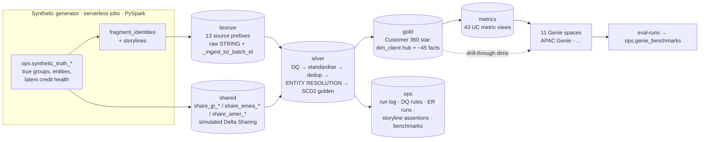

# SMBC APAC Genie — Phase 0 discovery report and build plan

> Status: **Phase 0 (read-only).** Nothing has been created in any Databricks workspace.
> This is the planning artifact for `SMBC_APAC_Genie_Master_Prompt_v2_Customer360.md` (the "brief").
> When you reply **go**, section 4 seeds `docs/DECISIONS.md` and Phase 1 starts.
> Items marked ⏳ need a valid workspace login to verify.

---

## 1. Discovery report

The original discovery notes described the build author's own workspace, CLI profiles and tools; they are omitted from the public copy. Section 2 keeps the platform facts that shaped the design.

---

## 2. Verified platform facts that shape the design

### 2.1 Genie (docs now say "Genie Agents (formerly Genie Spaces)"; API paths unchanged)

Verified against the docs, the REST reference, Python SDK v0.145.0 source and CLI help on 2026-10-02.

- **Create:** `POST /api/2.0/genie/spaces` with `{warehouse_id, serialized_space (JSON string), title?, description?, parent_path?}`.
- **Update:** `PATCH /api/2.0/genie/spaces/{id}`. `serialized_space` is a full replacement; `etag` is optional (Preview).
- **Read and remove:** `GET …?include_serialized_space=true`, `GET /spaces` (paged), and `DELETE` (moves the space to trash).
- **`serialized_space` v2** has these top-level keys:
  - `config.sample_questions`
  - `data_sources.tables`
  - **`data_sources.metric_views`** (same shape as tables)
  - `instructions.{text_instructions, example_question_sqls, sql_functions, join_specs, sql_snippets.{filters, expressions, measures}}`
  - `benchmarks.questions`
- **Column configs:** `column_name`, `description[]`, `synonyms[]`, `enable_format_assistance`, `enable_entity_matching`, `exclude`.
- **Validation rules:**
  - IDs are 32-character lowercase hex and unique within their group.
  - Every list must be **pre-sorted**: tables and metric views by `identifier`, `column_configs` by `column_name`, everything else by `id`.
  - Multi-line strings are arrays of strings.
  - Each join spec's `sql` has exactly two elements: the condition, then `--rt=FROM_RELATIONSHIP_TYPE_MANY_TO_ONE--`.
- **Limits:**
  - 50 tables, views and metric views per space.
  - **100 instructions per space**: each example SQL, each SQL function and the single text block count as one each.
  - **1** `text_instructions` entry.
  - 200 snippets, 500 benchmarks.
  - Entity matching: 120 columns, 1,024 values per column, 127 characters per value.
  - SQL is cancelled after 5 minutes.
- **Parameterised example SQL:** `parameters[{name, type_hint:"STRING", description[], default_value:{values[]}}]` plus `usage_guidance[]`. Only `STRING` is verified as a type hint; Phase 7 will test the other types against a UI export.
- **SQL functions:** `{id, identifier}`. Each needs a COMMENT (Genie can't see the function body), and users need EXECUTE.
- **Benchmarks:** exactly one answer per question, `format:"SQL"`.
- **Eval-run API (Beta):**
  - `POST /spaces/{id}/eval-runs` with `{benchmark_question_ids?}` (an empty body runs all benchmarks).
  - Poll `GET …/eval-runs/{run}` until `eval_run_status=DONE`.
  - Pass rate = `num_correct/num_questions`; `num_needs_review` is reported separately.
  - Per-result `assessment` is `GOOD`, `BAD` or `NEEDS_REVIEW`, with `assessment_reasons`.
  - **Grading compares result sets exactly:** up to 5,000 rows, order-insensitive, 4 significant digits. Extra rows or columns count as wrong.
- **Permissions:** `PUT /api/2.0/permissions/genie/{id}` with `CAN_VIEW`, `CAN_RUN`, `CAN_EDIT` or `CAN_MANAGE`.
  - Consumers need SELECT on the data, EXECUTE on functions and CAN_RUN on the space.
  - Queries run on the author's embedded warehouse credentials.
- **Other:**
  - Creating or updating a space via the API **builds joins automatically from UC PK/FK constraints**.
  - Docs recommend metric views ("particularly effective"), ≤ 5 tables, ≥ 5 example SQLs and ≥ 5 benchmarks with 2–4 phrasings each.
  - Text instructions are a last resort.
  - User usage of Genie is free through 2027-01-31; service principals are billed.

### 2.2 Metric views

Verified on 2026-10-02. The docs moved to `/aws/en/uc-semantics/metric-views/`.

- **DDL:** `CREATE OR REPLACE VIEW … WITH METRICS LANGUAGE YAML [COMMENT '…'] AS $$ … $$`. There is no `CREATE METRIC VIEW`.
- **Versions:** `version` is **required**; only `0.1` and `1.1` exist.

  | Feature | Minimum runtime |
  |---|---|
  | Metric views | DBR 16.4 |
  | YAML 1.1 (`comment`, `display_name`, `format`, `synonyms`), snowflake joins, materialization | DBR 17.3 / DBSQL 2025.30 |
  | Window `offset`, `cardinality: one_to_many`, `rely` | DBR 18.1 |
  | `parameters` (Preview) | DBR 18.2 |

  - Warehouses on the Current channel are at 2026.36.
  - Serverless compute is ≈ DBR 18.2.
- **Top-level keys:** `version`, `comment`, `source`, `parameters`, `filter`, `joins`, `fields` (`dimensions` is an accepted synonym), `measures`, `materialization`.
  - `source` can be a table, a view, **a SQL query** or another metric view.
- **Fields and measures:**
  - `comment`, `display_name` (≤ 255 chars), `synonyms` (≤ 10), and a structured `format`: `{type: number|currency|percentage|date…, currency_code, decimal_places{type,places}, abbreviation}`.
  - YAML comments **are** what Unity Catalog stores. `ALTER VIEW` removes comments that aren't in the YAML, so every comment lives in the YAML.
- **Joins:**
  - Each join is a LEFT OUTER, many-to-one join. `on` takes `source.` plus the join name (unqualified columns resolve to the joined table). `using:` is supported.
  - Snowflake joins nest `joins:`, and fields use the dot path, e.g. `client.grp.group_name`.
  - **Joined tables cannot contain ARRAY or MAP columns.** This affects `dim_client.aliases` and `source_systems_present` (see D31).
- **Measures:**
  - Any aggregate works, including COUNT DISTINCT, `FILTER (WHERE …)`, MEDIAN and percentiles.
  - Measures can compose: `MEASURE(a) / MEASURE(b)`, provided the referenced measure is defined first.
  - A window measure can't reference another window measure.
- **Window measures** (no preview label):

  ```yaml
  window: [{order: <field>, range: current|cumulative|trailing N day|month|year, semiadditive: first|last, offset: -12 month}]
  ```

  - `range: current` + `semiadditive: last` is the documented closing-balance pattern. It takes the latest period when a query spans several, and still sums across accounts.
  - **Hierarchy fields (Fiscal Year, Quarter) must be derived from the order field**, otherwise results are wrong.
  - Units are day, month or year only.
  - A filter bug was fixed in DBSQL 2026.20 and the serverless update of 2026-07-06.
- **Querying:**
  - ``SELECT `dim`, MEASURE(`m`) FROM mv WHERE … GROUP BY …`` — `GROUP BY ALL` is optional. `SELECT *` is not allowed.
  - **Metric views can't be joined to other tables at query time.** Wrap the query in a CTE, then join.
  - `LIMIT` and `HAVING` aren't documented, so example SQL uses an outer `SELECT … WHERE`.
- **Grants and tags:**
  - `CREATE OR REPLACE` **drops grants**, so SELECT is granted at schema level, where it is inherited.
  - `ALTER VIEW … AS $$…$$` keeps grants.
  - Tags use `ALTER VIEW … SET TAGS`.
- **Gotchas:**
  - Quote `'on'` in YAML.
  - Quote any `expr` that starts with a backtick or contains a colon.
  - Field names may contain spaces (backtick them in SQL). `%` in names is undocumented, so the Phase-2 smoke test checks it (fallback: "Pct").

### 2.3 CLI and bundles (from the v1.19.0 release notes and bundle JSON schema)

- v1.x uses the **direct deployment engine**. Terraform has been deprecated since v1.11, which also avoids the Terraform GPG-key failure seen in the workspace.
- Bundle resource types include `catalogs`, `schemas`, `sql_warehouses`, `jobs`, `dashboards`, `volumes`, `secret_scopes` and **`genie_spaces`**:
  - Fields: `title`, `description`, `warehouse_id`, `parent_path`, `permissions`, and `file_path` (a `.geniespace.json` file) or inline `serialized_space`.
- Python bundles (PyDABs) can define Genie spaces from v1.17.
- `databricks genie ask "…"` is available for quick smoke questions.

### 2.4 Serverless compute (verified 2026-10-02)

- **Not available:** `sparkContext` or RDDs, and `cache()`, `persist()`, `checkpoint()` or `CACHE TABLE` (they throw). It's Spark Connect, so analysis is lazy and temp view names must be unique.
- **Spark config:** only six settings are allowed, including `spark.sql.shuffle.partitions`, `spark.sql.session.timeZone` and `spark.sql.ansi.enabled` (default true).
- **Dependencies:** only via `environments.spec.dependencies` (or `%pip`). Never install `pyspark`. Prefer `py3-none-any` wheels, because the CPU can be aarch64 or x86_64.
- **Environment versions:** `environment_version` (`client` is deprecated) is 1–6; 3–6 are Python 3.12. The server is always the latest serverless runtime (≈ 18.2), so the version only pins client libraries.
- **UDFs and limits:**
  - Python and pandas UDFs, `applyInPandas` and UDTFs work (1 GB memory per UDF, no internet).
  - `createDataFrame` is capped at 128 MB per call.
  - Runs can last up to 7 days.
  - STANDARD performance mode adds 4–6 minutes of startup; `performance_target: PERFORMANCE_OPTIMIZED` avoids it.

### 2.5 AI functions (verified 2026-10-02)

- **`ai_analyze_sentiment(content)`** returns `'positive' | 'negative' | 'neutral' | 'mixed'` or NULL.
  - Public Preview; works on serverless SQL and DBR, so also in serverless jobs via `spark.sql`.
  - Submit the full dataset in one query. It is billed as batch inference.
- **`ai_forecast(TABLE(...), horizon, time_col, value_col [, group_col, prediction_interval_width, frequency, …, version])`** returns `{v}_forecast`, `{v}_upper` and `{v}_lower`.
  - **Databricks SQL only** (Pro or Serverless warehouse).
  - v1 is the default; pin `version => '1'`. v2 needs the Predictive AI Functions preview enrolment.
  - It does not fill gaps, so build a date spine first.
- **`ai_query`** (GA, `responseFormat` for structured output), and **`ai_classify` / `ai_extract`** (GA, VARIANT output in v2.x, **not usable inside views**, so results must be materialised).

### 2.6 Unity Catalog DDL (verified 2026-10-02)

- **Constraints:** `CONSTRAINT pk PRIMARY KEY (sk) NOT ENFORCED RELY` and `FOREIGN KEY (sk) REFERENCES dim (sk) NOT ENFORCED RELY` (FK RELY needs DBR 15.4+).
  - **CTAS can't declare constraints or column comments**, so gold uses explicit `CREATE TABLE` DDL followed by `INSERT OVERWRITE` (D38).
  - An SCD2 FK must target the surrogate PK.
- **Liquid clustering:** `CLUSTER BY (≤ 4 cols)` or `CLUSTER BY AUTO`. `ANALYZE TABLE … FOR ALL COLUMNS` works on DBSQL.
- **Comments:** `COMMENT ON COLUMN t.c IS '…'` (DBR 16.1+); multi-column `ALTER TABLE … ALTER COLUMN a COMMENT 'x', b COMMENT 'y'` (DBR 16.3+). `CREATE OR REPLACE TABLE` now preserves existing comments.
- **Tags:** `ALTER CATALOG|SCHEMA|TABLE|VIEW … SET TAGS`, and `ALTER TABLE … ALTER COLUMN … SET TAGS`.
  - Keys can't contain `. , - = / :`.
  - Up to 50 tags per object.
  - **A free-form tag fails if its key matches an account-level governed tag**, which is possible on a shared demo account (checked in Phase 2).
- **SQL table functions:** `CREATE OR REPLACE FUNCTION f(p STRING DEFAULT … COMMENT …) RETURNS TABLE (…) COMMENT … RETURN SELECT …`. Using `MEASURE()` inside a function body is undocumented, so it's in the Phase-2 smoke test.
- **Grants and entitlements:**
  - Schema-level `USE SCHEMA, SELECT, EXECUTE` covers views, metric views and functions.
  - Grants need **account-level groups**.
  - **Since 14 Sep 2026 the workspace `users` group carries no entitlements.** Consumers need "Consumer access" or "Databricks SQL access" explicitly.

### 2.7 Bundles and Delta Sharing (verified 2026-10-02)

- **Renames:** Asset Bundles are now "Declarative Automation Bundles", and the Delta Sharing docs are now "OpenSharing". CLI v1.0.0 shipped on 2026-05-21.
- **`genie_spaces` bundle resource:** CLI ≥ v1.3.0, direct engine only.
- **Job and task syntax:**
  - `sql_task: {warehouse_id, file: {path}}` accepts multi-statement files and named markers such as `IDENTIFIER(:catalog)`.
  - Job parameters push down to SQL tasks automatically.
  - `run_job_task: {job_id: ${resources.jobs.x.id}, job_parameters: {...}}`.
  - `variables: {warehouse_id: {lookup: {warehouse: "<name>"}}}` errors if zero or several warehouses match.
- **Delta Sharing:** Databricks-to-Databricks sharing **to the same metastore isn't supported**, and AWS has one metastore per region.
  - A real share (Phase 10b) needs a second workspace in **another region or account**. A Tokyo-region workspace acting as the "JP lakehouse" would make that story literal.
  - Open sharing to yourself works, but needs the account-admin external-sharing toggle and is subject to the serverless egress policy.

---

## 3. Architecture



Execution:

- Python generators, entity resolution and transforms run as serverless jobs, deployed by the bundle.
- DDL, comments, constraints and metric views run on the SQL warehouse through one templated SQL runner.
- Genie spaces are built by a Python task that calls the REST API.
- `databricks bundle deploy` + `databricks bundle run build_all` rebuilds everything from an empty catalog.

---

## 4. Key design decisions (proposed; these become `docs/DECISIONS.md`)

| ID | Decision | Why |
|---|---|---|
| D01 | **This folder is the repo root** (rather than a nested `smbc-apac-genie/`). The brief stays at the root. `git init` in Phase 1, one commit per phase. | Keeps the brief next to the code. |
| D02 | **CLI ≥ 1.19** (direct engine) plus **uv + Python 3.12** for local tooling (databricks-sdk, pytest, pyyaml). No Databricks Connect dependency. | Gives the bundle resources and avoids Terraform. Local tests talk to the SQL warehouse through the Statement Execution API. |
| D03 | Compute: **serverless jobs** for PySpark, **serverless SQL warehouse** for DDL, metric views and Genie. No classic clusters. | The workspace is serverless-only. |
| D04 | Reusable code lives in the importable package **`src/smbc_genie_lib/`**, which the bundle builds as a wheel. The numbered dirs from Appendix C hold the entry scripts and SQL. | Folders like `10_bronze_synth` can't be imported, and a wheel keeps serverless imports reliable. |
| D05 | **One SQL runner** executes templated `.sql` files (`${catalog}`, `${as_of_date}`) on the warehouse. PySpark is used only where logic needs it. | DDL and metric views always run on the newest DBSQL runtime. |
| D06 | **Genie spaces are created and updated by `src/50_genie/create_spaces.py`** via REST:<br>• idempotent (space_id stored in `ops.genie_spaces`, with a title lookup as fallback)<br>• grants `CAN_RUN` to the consumer group<br>• benchmarks run through eval-runs<br>We also emit `genie/<slug>/<slug>.geniespace.json` so spaces can move to bundle `genie_spaces` later. | Spaces can only be created after the metric views exist. Doing this in a job keeps "deploy + build_all from an empty catalog" a single flow. |
| D07 | The catalog, schemas, grants and tags are created with **idempotent SQL**, not bundle catalog resources. | Teardown stays an explicit, confirmed step (brief §3.6). |
| D08 | **Determinism:**<br>• Spark uses hash-based randomness: `u = xxhash64(seed, salt, key)` → [0,1). It never depends on partitioning or `rand()`.<br>• The driver uses `numpy.default_rng([seed, salt])` for dimensions.<br>• AI-function outputs are the only non-deterministic columns, and they are kept separate. | The brief requires identical output for identical config. |
| D09 | **SCALE semantics:**<br>• Dimensions are fixed.<br>• Event facts are sampled at SCALE.<br>• Daily facts keep a daily window of max(9 months, 42×SCALE months) plus full month-end history.<br>• Storyline entities are always generated in full.<br>• Count-based assertions scale with SCALE. | Tests must pass at both 0.1 and 1.0 (definition of done). |
| D10 | **Payments history starts 2024-04-01.** The 17-Jun-2026 duplicate is a *month-to-date replay* batch of about 41k messages. | Keeps ~1.8M payment rows. A single day's batch is ~3–5k, so 41k duplicates only make sense as a replay, which is a common payments-hub incident. |
| D11 | **SCD2 "as-was" joins:**<br>• Facts carry the `golden_client_sk` of the version valid at the fact date, plus the durable `golden_client_id`.<br>• Metric views join on the SK, so at AS_OF they show the current version.<br>• Volatile attributes (band, rating, stage, watchlist) version at month-ends only. | Gives correct point-in-time attributes without exploding the number of SCD2 versions. |
| D12 | **Group-grain facts** (plans, wallet, global exposure) carry `client_group_id` and `lead_golden_client_sk`. `dim_client_group` carries the group's segment, tier, lead office, lead RM, worst rating and worst EWS band. | Keeps the same client vocabulary at group grain. |
| D13 | **Multi-grain patterns:**<br>• *Primary-row allocation*: coarser-grain values sit on one row and are NULL elsewhere.<br>• *record_type union bases* (`gold.mvb_*`): facility/covenant/collateral, case/document, review-snapshot/screening, trade issuance/outstanding, RM activity/coverage, ER run stats/steward items, watchlist events/membership.<br>• *Precomputed* peer, rank, trend and precedence flags in gold. | Metric-view measures must aggregate correctly at any grain, and "absence" questions (e.g. "no RM contact in 90 days") need rows to count. |
| D14 | **43 metric views**: 42 from the brief plus `mv_er_exposure_impact` in Data Foundation (5 in that space). | The Meridian "exposure +40% after resolution" question doesn't fit the grain of any other view. |
| D15 | Where a must-answer question lists free-text detail, a narrow **detail dim** can be a space asset (e.g. `dim_account_plan_initiative`), capped at ≤ 12 assets. | Keeps metric views clean while still answering "list the initiatives…". |
| D16 | **"Today" = AS_OF_DATE (30 Sep 2026).**<br>• Genie is told never to use `CURRENT_DATE()`.<br>• `dim_date` carries `days_before_as_of`, `is_latest_closed_month`, `is_fytd` and `is_prior_fytd_same_period`.<br>• Gold functions `fn_as_of_date()` and `fn_latest_closed_month()` read `ops.build_config`. | Demo answers stay stable regardless of the real date. |
| D17 | **Fiscal labels follow the Japanese FY.** Financial statements keep each client's own fiscal year-end (March for Japanese groups, December for most others): "FY2025" means FYE Mar-2026 or Dec-2025 respectively, via `fye_month`. | Matches how credit teams talk about "FY2025 financials". |
| D18 | **Sentiment:**<br>• The numeric −1..1 score comes from template tone plus light noise (deterministic and safe for storylines).<br>• When available, an `ai_analyze_sentiment` **label** is stored alongside it (`ai_sentiment_label`), with the agreement rate reported in Data Foundation. | `ai_analyze_sentiment` returns labels, not scores, and is non-deterministic. Storylines need pinned values (Sunda ≈ −0.6). |
| D19 | **Forecasts:** synthetic v1 (MAPE ≈ 18%) and v2 from Jun-2026 (≈ 11%). If `ai_forecast` exists, an optional `v3_ai` challenger runs for the top-N clients. | Storyline 9 needs controlled accuracy. |
| D20 | **Profitability definitions** (in `gold.dim_threshold`):<br>• RoRWA = annualised net contribution ÷ average RWA (hurdle 1.2%; revised in Phase 3c-6/3c-17, see DECISIONS D20).<br>• RAROC hurdle 12%.<br>• ROE = net income ÷ allocated capital (hurdle 10%).<br>Sponsor & Structured Finance RAROC ≈ 14% (it does not lead; see DECISIONS D20). | The brief's illustrative 8% RoRWA / 14% figures are unreachable on a net-of-cost basis; realistic levels keep every profitability answer credible to a bank audience. |
| D21 | **Conversion:**<br>• Pipeline conversion = won ÷ (won + lost).<br>• "Converted to Pipeline %" = signals with a linked opportunity ÷ signals.<br>• Storyline 6: 14 created, 10 closed (6 won) → 60%. | 60% of 14 isn't a whole number. |
| D22 | **Entity resolution:**<br>• 7 identity sources.<br>• Rule set **v1** for the Jun/Sep/Dec-2025 runs.<br>• Rule set **v2** from Mar-2026 (abbreviation dictionary, cross-country name blocking, name+country exact match).<br>• Steward decisions are simulated from truth with a 2% error.<br>• 6 quarterly runs are **replayed** against as-of snapshots. | Produces a real run history, and Meridian merges in the March-2026 run for a real reason. |
| D23 | **Names:**<br>• Invented Japanese and APAC stems, checked against a blocklist of well-known real companies and banks.<br>• Fictional competitor banks.<br>• IDs use clearly synthetic `SYN…` prefixes, with no real LEI or BIC formats. | Brief §3.5. |
| D24 | **Extra bronze tables** to support ER and the use cases:<br>• `trade_party`, `tsy_counterparty`, `credit_obligor`<br>• `crm_account_team_history`, `crm_account_plan_initiative`, `crm_nbp_score`, `crm_signal`<br>• `kyc_feedback`<br>• `core_facility_balance_monthly`, `core_liquidity_structure` (+ `_participant`)<br>• `pay_channel_usage` | ER needs an identity master in each source, and several facts need a landing. |
| D25 | **One column dictionary** (YAML) plus per-table overrides generates all COMMENT DDL. The **gate is 100% on gold + metrics**; bronze and silver coverage is reported. | Comments are written once and stay consistent. |
| D26 | `group_name` is the short brand ("Kinokawa Precision"). Entity legal names include location and legal form. JP parent names live in `shared`. | Natural phrasing ("Kinokawa Precision group") resolves with a simple LIKE match or entity matching. |
| D27 | `shared` tables are named `share_<region>_*` and carry `source_region`, `ingest_method='delta_sharing'`, `_share_name`, `_provider_version` and `_shared_at`. The refresh log is simulated for freshness. | Brief §3.2 and storyline 13. |
| D28 | Tests are pytest suites that run locally (Statement Execution API) **and** as a job task. Storyline assertions are also written to `ops.storyline_assertions`. | Lets tests run without a local Spark. |
| D29 | **Thresholds in one table** (`gold.dim_threshold`): hurdles, the single-borrower attention threshold (USD 500m), EWS band cut-offs (Green < 40, Amber 40–69, Red ≥ 70) and SLA days. | SQL, Genie and docs share one source. |
| D30 | **Benchmark expected SQL** is minimal and names its output columns explicitly, and questions are phrased to pin the output. Phrasing variants test generalisation. | Genie grading fails on extra columns or rows. |
| D31 | `dim_client` keeps `aliases` and `source_systems_present` as ARRAYs (per the brief). Metric views join a **projection without the arrays**: either `source: SELECT * EXCEPT (aliases, source_systems_present) FROM gold.dim_client`, or a thin view `gold.dim_client_core` if a query can't be used as a join source (checked in the Phase-2 smoke test). Delimited-string copies (`aliases_text`, `source_systems_text`) keep the arrays usable in metric views. | Joined tables in metric views can't contain ARRAY or MAP columns. |
| D32 | **Point-in-time measures are window measures** (`order: Date` or `Month`, `range: current`, `semiadditive: last`). This covers balances, exposure, RWA snapshots, ECL, watchlist membership, open or overdue counts, outstanding trade, SCF utilisation and closing cash balances. They're named plainly (e.g. "CASA Balance USD") and commented "point-in-time; latest period in the selection". Flow measures stay plain SUMs. | Makes "never sum balances across months" automatic instead of relying on Genie to follow an instruction. |
| D33 | Calendar fields inside each metric view (`Month`, `Fiscal Year`, `Fiscal Quarter`, `Fiscal Half`, `Is Latest Month`) are **derived from the window's order field**, using inline JP fiscal-year expressions rather than a `dim_date` join. | The docs say hierarchy fields not built on the order field return wrong window results. |
| D34 | SELECT is granted at **schema** level on `gold` and `metrics`. Views are rebuilt with `CREATE OR REPLACE` or `ALTER VIEW`, so grants are always inherited. | `CREATE OR REPLACE` drops per-object grants. |
| D35 | Cross-view questions (e.g. payments YoY joined with deposits) are taught via example SQL that **wraps each metric-view query in a CTE and joins the CTEs**. | Metric views can't be joined directly at query time. |
| D36 | `ai_analyze_sentiment` runs in silver on serverless jobs, in one batch query per table. The optional `ai_forecast` **v3_ai challenger runs on the SQL warehouse** through the SQL runner, pinned to `version => '1'`, over a date spine. v2 is used only if the workspace is enrolled in the preview. | `ai_forecast` is Databricks SQL only. The default version will change, and it doesn't fill gaps. |
| D37 | Tag keys are `domain`, `layer`, `quadrant`, `pii`, `synthetic` and `source_region` (no forbidden characters). Phase 2 first checks for clashes with account-level governed tags; on a clash it falls back to `smbc_`-prefixed keys. | Governed tags on a shared demo account could make the free-form `SET TAGS` fail. |
| D38 | **Gold tables use explicit `CREATE TABLE` DDL** (typed columns with COMMENT, PK/FK constraints, `CLUSTER BY`), generated from the column dictionary and followed by `INSERT OVERWRITE … SELECT`. Silver may use CTAS plus `COMMENT ON COLUMN`. | CTAS can't carry column comments or constraints. |
| D39 | The consumer group needs the workspace entitlement **"Consumer access"** (or "Databricks SQL access") as well as UC grants and CAN_RUN. Phase 2 checks it and asks you if an admin action is needed. | Since 14 Sep 2026 the `users` group has no default entitlements. |
| D40 | Serverless jobs use `environment_version: "5"` (Python 3.12.3; fallback "4"). Development runs use `performance_target: PERFORMANCE_OPTIMIZED` to avoid the 4–6 minute STANDARD startup; the demo build can use STANDARD to save cost. | The version pins only client libraries; the server runtime is always current. |
| D41 | **A real Delta Share (Phase 10b) needs a second workspace in a different AWS region or account**, ideally Tokyo as the literal "JP lakehouse". Until then, `shared` is simulated. | Same-metastore Databricks-to-Databricks sharing isn't supported, and AWS has one metastore per region. |

---

## 5. Synthetic data design

### 5.1 True universe (`ops.synthetic_truth_*`)

- **380 client groups by segment:** Japanese Corporate 190 · Non-Japanese Large Corporate 110 · Financial Institution 35 · Sponsor & Structured Finance 25 · Public Sector 20.
  - Japanese Corporate industries: auto and parts, electronics and semis, trading houses, shipping and logistics, chemicals, construction and real estate, machinery, food.
- **Tiers:** Strategic ≈ 60, Core ≈ 150, Transactional ≈ 170. Strategic is skewed to the large Japanese and NJLC groups.
- **2,500 APAC legal entities** across 13 booking locations: SG 22%, HK 14%, CN 10%, TH 9%, ID 8%, IN 7%, AU 7%, VN 6%, MY 5%, TW 4%, KR 4%, PH 3%, NZ 1%.
  - Entities per group follow a Pareto distribution, from 1 up to about 40 (trading houses).
  - Each entity's coverage office is its booking entity.
- **Shared universe:**
  - 380 group masters (Tokyo HO global group master).
  - JP parent records for the Japanese groups, plus JP-booked exposure for some others.
  - About 600 EMEA and AMER subsidiaries.
  - About 220 listed parents with market data.
- **People:** about 240 fictional staff (≈120 RMs, 60 credit analysts, 30 TB sales, 25 onboarding officers, plus approvers) and about 6,000 client contacts.
- **Products:** 4 business lines → 10 families (Corporate Lending, Structured Lending, Cash, Liquidity, Payments, Trade Finance, SCF, FX, Rates, Sustainable Finance) → about 35 products.
- **Latent credit health:** each entity has a monthly AR(1) process driven by its industry cycle, country and idiosyncratic shocks.
  - Industry cycles: coal and shipping turn negative in 2025–26; renewables and data centres turn positive.
  - Health drives ratings, utilisation, deposit behaviour, covenant headroom, DPD and news tone. This gives the real correlations the brief asks for, such as news weakly preceding downgrades.
- **Calibration targets:**
  - Pareto concentration: top 10% of groups ≈ 60% of deposits and 55% of drawn lending.
  - Lognormal ticket sizes.
  - Business-day seasonality per location.
  - Quarter-end and March fiscal-year-end spikes.
  - Japanese subsidiaries rate better and price tighter.
  - Financial statements reconcile: the balance sheet balances and cash flow ties to the change in cash.

### 5.2 Identity fragmentation

| Element | Rule |
|---|---|
| Identity sources | `core_customer`, `crm_account`, `kyc_customer`, `credit_obligor`, `trade_party`, `tsy_counterparty`, `ext_company_master` |
| Records per entity | 2–4 source IDs (≈ 7,900 records in total) |
| Noise rates | 6% duplicates within a source · 2% wrong country · 3% stale parent link · 1.5% of entities appear in only one source |
| Name variants | Case changes; punctuation; legal-form variants (`Pte. Ltd.` / `PTE LTD` / `Private Limited`, `Co., Ltd.`, `Sdn Bhd`, `PT … Tbk`); a parenthetical location added or dropped; abbreviations (`Intl`, `Hldgs`, `Mfg`, `Elec`); word order; a **35-character truncation in core banking**; 1-character typos (5%); romanisation variants |
| ID presence (LEI-like) | ext 95%, KYC 80%, credit 60%, tsy 50%, CRM 40%, core 30%, trade 20% |
| ID presence (tax ID) | KYC 90%, ext 85%, core 70%. 1% of tax IDs carry formatting noise. |
| Guarantees | Never make a storyline unrecoverable. Storyline entities use explicit, scripted fragmentation (e.g. Meridian = 5 records with 1 wrong country). |

### 5.3 Target volumes (SCALE 1.0)

| Area | Rows |
|---|---|
| Deposits | Daily ≈ 8M (9,000 accounts × ~880 business days); monthly ≈ 380k |
| Payments | ≈ 1.8M from FY2024, plus ≈ 41k replay duplicates in bronze only |
| FX deals | ≈ 300k |
| Trade | 140k instruments · 400k events · 90k presentations |
| SCF | 40 programmes · 1,900 suppliers · 300k invoices |
| Lending | 1,900 facilities · ≈ 80k monthly snapshots · ≈ 11k covenant tests · ≈ 2,600 collateral items |
| Financial statements | Long format ≈ 700k lines (2,500 × 3 FY × 3 statements) |
| Ratios and peers | Ratios ≈ 150k · peer benchmarks 40 × 20 × 3 |
| Credit reviews | ≈ 3,600 reviews, plus ≈ 7,500 spreading tasks |
| EWS | Signals ≈ 260k · daily scores ≈ 2.2M · watchlist events ≈ 600 · DPD days ≈ 100k |
| CRM | Activities 60k · opportunities 2,600 · plans 380×4 (by product family) · initiatives ≈ 5k · wallet 380×3×families |
| Signals and scores | Opportunity signals ≈ 45k · NBP scores ≈ 180k (last 6 months) |
| Onboarding and KYC | 2,100 cases · 12k stage events · 9,000 KYC reviews · 150k screenings · ≈ 15k documents |
| Profitability | Revenue ≈ 600k · cost and capital ≈ 105k each · deals 1,100 |
| Cashflow | Actuals ≈ 1.5–3M (derived from payments, so bounded by them) · forecasts ≈ 1.2M · events 1,800 |
| News and markets | News 25k · RM-note sentiment 60k · market daily ≈ 200k · unified signals ≈ 300k |
| Data Foundation | 6 ER runs · coverage ≈ 840k · DQ ≈ 25k · share freshness ≈ 16k |

### 5.4 Storylines: how each is made true, and its key assertions

Each storyline is a parameterised injector in `storylines.py`, configured in `config/smbc_genie.yaml`. Its assertions live in `tests/test_storylines.py` and `ops.storyline_assertions`. Base generators keep non-storyline entities away from storyline thresholds (for example, leverage headroom is ≥ 12% except for scripted clients), so exact counts hold.

| # | Storyline | Mechanics (sources touched) | Key assertions |
|---|---|---|---|
| 1 | **Sunda Energi Nusantara** — EWS cascade | Jan-26 coal-regulation news cluster (`ext_news`) → Feb deposit outflow −35% in 30 days (`core_deposit_balance`) → Mar utilisation 95% (`core_facility_balance_monthly`) → Apr DPD 15 then 30 (`core_dpd`) → May covenant breach on the FY2025 spread, ND/EBITDA 4.6x vs 4.0x (`credit_*`) → Jun downgrade grade 7→9, Stage 3, watchlist Red, ECL +48m (`core_rating_history`, `ews_watchlist`, `fin_capital_allocation`). The EWS score path runs 22 → 78. The annual review is submitted 23 days late (`credit_review`). | Jan news sentiment between −0.7 and −0.5 · Feb outflow 30–40% · Mar utilisation ≥ 95% · DPD 15 and 30 both in Apr · breach 4.6 vs 4.0 · grade 9 / Stage 3 / Red in Jun · ΔECL 45–51m · score 22±2 in early Jan and 78±2 at end-Jun · review 23 days late |
| 2 | **Kinokawa Precision** — wallet loss and recapture | USD 400m facility prepaid in Feb-26 (Q4 FY2025) → monthly `loan-service` payments to a fictional other bank from Jan-26 → revenue −22% YoY while deposits hold → FY2026 plan reset mid-year (revised target) → CN→VN trade-settlement flows +50% → signals `TRADE_CORRIDOR_GROWTH`, `SCF_ANCHOR_CANDIDATE`, `FX_FLOW_VIA_OTHER_BANK`, `LOAN_SERVICE_TO_OTHER_BANK` → NBP ranks SCF #1 → USD 120m SCF opportunity created Aug-26, linked to its source signal | Revenue YoY between −25% and −19% · deposit change within ±5% · plan `mid_year_revision` true · corridor +45–55% · NBP rank 1 = SCF · opportunity 120m created in Aug |
| 3 | **Meridian Agri Holdings** — why ER matters | 5 scripted source records (core ×2 with different spellings, CRM, trade, KYC), one with the wrong country. v1 runs split them into 3 golden records; the **Mar-2026 v2 run** merges them into 1. Group exposure +40% after resolution, crossing the USD 500m attention threshold. A 2025 onboarding case for the Thai subsidiary is unmatched at intake and matched after account opening. | 3 → 1 golden records at the 2026-03-31 run · exposure change between +35% and +45% · threshold crossed · onboarding case `match_timing='After Account Opening'` |
| 4 | **Tanaka Chemical** — JP parent support | APAC subsidiary turns Amber in Jul-26 (utilisation spike plus weak FY2025 ICR) · `share_jp_support_letters` shows a keepwell · `share_jp_parent_rating` shows a Jun-26 parent upgrade · EWS override to Green with reason "parent support confirmed (JP data)" | Computed band Amber, final band Green · override reason matches · keepwell exists · parent upgrade dated Jun-26 |
| 5 | **HK CASA migration** | 3 Japanese electronics subsidiaries in HK move ≈ USD 900m from current accounts to 3–6-month TDs over Jun–Aug-26 · the HK book is calibrated so the CASA ratio goes 62% → 49% · May cashflow forecasts flag surpluses · `DEPOSIT_SURPLUS` signals actioned 40+ days late | HK CASA ratio 62±1.5% (May) and 49±1.5% (Aug) · moved amount 850–950m · signal action lag ≥ 40 days |
| 6 | **VN and IN trade surge** | Import LCs into VN and IN +40% YoY in H1 FY2026 (electronics and auto parts, from CN, KR and JP) · SG books 45% · 14 corridor-growth opportunities, 10 closed, 6 won | YoY 35–45% · SG share 42–48% · 14 created · win rate 60% |
| 7 | **KYC migration backlog** | Feb-26 workflow migration: median days-to-live 21 → 38 for Mar–May requests · FI segment's KYC Docs stage +12 days · high-risk periodic reviews overdue peak in May at 3× normal · 70% of the May backlog cleared by Sep | Medians 21±2 / 38±2 · FI ΔKYC-Docs 12±2 days · May overdue ≥ 2.7× baseline · 65–75% cleared |
| 8 | **Below-hurdle cluster** | ≈ 40 single-product Japanese-corporate lending relationships below the RoRWA hurdle (1.2%, D20) · SSF RAROC ≈ 14% (it does not lead; see D20) · 9 FY2025 deals approved below hurdle on "Relationship" exceptions (Apr–Dec-25 so they are seasoned), 3 of which caught up | Count 36–44 · SSF RAROC 13–15% · 9 deals / 3 caught up |
| 9 | **Cashflow model upgrade** | v2 from Jun-26: 30-day MAPE 18% → 11% · 23 predicted shortfalls Jun–Sep, 15 followed by an RCF drawdown within 10 days (`core_loan_schedule` drawdowns) | MAPE 17–19% / 10–12% · 23 / 15 |
| 10 | **Australian renewables sponsor** | Strongly positive expansion news Apr–Jul-26 · 2 green loans in pipeline · 1 `SLL_ELIGIBLE` signal | Average sentiment ≥ 0.6 · 2 green-loan opportunities · 1 SLL signal |
| 11 | **Covenant blind spot** | Exactly 5 clients with leverage headroom 0–10% at the FY2025 test (Sunda breached separately) · 3 of them not on the watchlist | 5 / 3 (so 5.3 Q2 returns 6 rows: 1 breach + 5) |
| 12 | **Reprocessed payments file** | Month-to-date replay batch `PAY_20260617_R` lands the 1–17 Jun messages again · silver dedups ≈ 41k on `message_id` and logs to `dq_results` | Duplicates removed = 41k ± 2k × SCALE · gold totals = truth totals |
| 13 | **Delta Share staleness** | `share_jp_parent_rating` has no refresh 11–15 Aug-26 (lag > 24h for 5 days) · Tanaka's Aug override re-confirmation is flagged `source_data_stale` | 5 stale days · override audit flag set |

Names for scripted entities (fictional):

- Kinokawa Precision (SG / TH / VN / CN / IN / ID entities)
- Hayashi Marine Logistics (HK / SG / …)
- Tanaka Chemical (Tanaka Chemical Asia Pte Ltd, SG)
- Sunda Energi Nusantara (ID)
- Meridian Agri Holdings (SG-HQ, with ID / MY / TH / IN / AU entities)
- AU renewables sponsor: e.g. *Banksia Renewables Partners* (to be blocklist-checked)
- HK electronics trio: e.g. *Shiramine Electronics (HK) Ltd*, *Aokumo Semiconductor Hong Kong Ltd*, *Hoshioka Devices (Hong Kong) Ltd*

### 5.5 Generation order (`src/10_bronze_synth/run_bronze.py`)

1. `truth.py`: true groups, entities, people, products, latent health and attribute timelines.
2. **`storylines.apply_to_truth()`** (early hook) scripts the storyline entities' timelines and events: news clusters, outflows, utilisation, DPD, breaches, rating events, plan reset, corridor growth and so on. Every downstream engine then *derives* consistent effects. For example, Sunda's outflow lowers deposit NII, changes cashflows and fires EWS triggers; nothing is patched afterwards.
3. `generators/ref.py`: calendar, holidays, FX, countries, currencies, industries and peers.
4. `generators/shared_*.py`: JP, EMEA and AMER shares, plus the refresh log.
5. Quantitative feeds: core → tsy → pay → trade → credit → fin → cf. Later feeds read earlier ones, so revenue derives from balances and flows, and cashflow derives from payments.
6. The EWS engine simulation (signals and scores from the generated behaviour), then the CRM signals, NBP and pipeline engines. Scripted score paths (Sunda 22 → 78) are pinned at key dates.
7. Qualitative text: news, RM notes, memo excerpts, feedback (templates with slot-filling, ≤ 40 words).
8. `fragment_identities()`, then **`storylines.apply_to_bronze()`** (late hook) for the data-layer storylines: Meridian's scripted fragmentation, the 17-Jun replay batch, the JP-share refresh gap and the scripted ER history.
9. Write with `_ingest_ts`, `_batch_id`, `_source_system` and `_source_file`, then row counts to `ops.build_run_log`. The pre-silver storyline checks run here, so a broken generator fails fast.

---

## 6. Silver and entity resolution

- **Standardise:**
  - Uppercase; strip punctuation; canonicalise legal forms; drop parenthetical locations; normalise countries to ISO-2; tokenise.
  - v2 adds abbreviation expansion.
  - Type casts follow the column dictionary.
- **Deterministic matching:** exact normalised LEI-like ID; tax ID + country. v2 adds normalised name + country.
- **Candidate generation (blocking):**
  - (country, first significant token)
  - (soundex(first token), country)
  - v2 adds (first two tokens) across countries, which catches wrong-country records.
- **Scoring:** 0.45 token Jaccard + 0.30 normalised Levenshtein + 0.15 address-token overlap + 0.05 same parent + 0.05 same country.
  - ≥ 0.90 → automatic fuzzy match.
  - 0.75–0.90 → **steward queue**, auto-decided from truth with a 2% error rate (documented as a simulated human review).
  - < 0.75 → reject.
- **Clustering:** connected components by iterative min-label propagation (clusters are ≤ ~8 nodes).
- **Golden IDs are stable across runs:** a cluster keeps its oldest golden ID, and merges and splits are recorded.
- **Survivorship:** attribute-level source priority.
  - Legal name, country and LEI: ext > KYC > credit > core.
  - Parent: ext > KYC > CRM.
  - Segment, tier and RM: CRM.
  - Rating and stage: credit/core.
  - KYC risk: KYC.
  - `golden_record_confidence` = f(match scores, number of sources, ID agreement).
- **SCD2** (`silver.client_golden`): monthly attribute states, collapsed into versions with `valid_from`, `valid_to` and `is_current`.
- **Run history:** the six quarterly runs are replayed on as-of snapshots of the source records: 2025-06-30, 09-30, 12-31 with v1, then 2026-03-31, 06-30, 09-30 with v2.
  - Outputs: `ops.entity_resolution_runs`, `fact_entity_resolution_run`, `fact_steward_queue` and `fact_group_exposure_by_er_run`.
- **Evaluation:** pairwise precision and recall plus cluster purity against `ops.synthetic_truth_*`. Gate ≥ 0.97 / ≥ 0.95.
- **Data quality:**
  - ≈ 150 rules defined in YAML → `ops.dq_rules` → `silver.dq_results`, covering completeness, validity, uniqueness, timeliness and consistency.
  - Orphans go to `silver.quarantine_*`.
  - Business keys are deduplicated, which removes the payments replay.
  - The current run's DQ results are appended to simulated DQ history, so the 42-month trend is continuous.
- **Conform shared data:** map JP, EMEA and AMER records onto golden and group keys.

---

## 7. Gold Customer 360 model

**Hub dimensions:**

- From the brief: `dim_client` (SCD2), `dim_client_group`, `xref_client_source`, `dim_contact`, `dim_date`, `dim_booking_entity`, `dim_product`, `dim_employee`, `dim_industry`, `dim_signal_type`, `dim_ews_trigger`, `dim_onboarding_stage`, `dim_currency`, `fx_rate_daily`.
- Added: `dim_country`, `dim_peer_group`, `dim_account`, `dim_competitor_bank`, `dim_threshold`, `dim_scf_programme`, `dim_account_plan_initiative`.

**Facts:** every table listed in brief §5. The additions below are marked +.

| Domain | Facts |
|---|---|
| RM | `fact_account_plan_annual`, `fact_client_revenue_monthly`, `fact_product_holding_monthly`, `fact_wallet_estimate_annual`, `fact_rm_activity`, +`fact_client_coverage_monthly`, `fact_group_global_exposure_monthly` |
| Opportunity | `fact_opportunity_signal`, `fact_next_best_product_score`, `fact_pipeline_opportunity`, `fact_peer_penetration_annual`, +`fact_client_product_penetration_annual` (dense client × product × FY) |
| Credit | `fact_financial_statement_annual` (long), `fact_financial_ratio_annual` (with percentile rank and a direction-aware worse-than-P25 flag), `fact_peer_benchmark_annual`, `fact_facility_terms`, `fact_covenant_test` (with an is-latest-test flag), `fact_collateral`, `fact_credit_review_workflow` (including spreading tasks) |
| EWS | `fact_ews_signal_daily` (with a preceded-downgrade-in-90-days flag), `fact_ews_score_daily` (computed and final band, previous band, override event flag, source-data-stale flag), `fact_watchlist_event`, `fact_dpd_daily`, `fact_rating_migration`, +`fact_credit_exposure_monthly` (EAD, RWA, ECL, DPD bucket, cure flag) |
| Profitability | `fact_capital_allocation_monthly`, `fact_cost_allocation_monthly`, `fact_deal_pricing`, `fact_client_pnl_waterfall_annual` |
| Onboarding | `fact_onboarding_case` (match timing, first-transaction lag), `fact_onboarding_stage_event`, `fact_kyc_review`, +`fact_kyc_review_snapshot_monthly`, +`fact_kyc_document`, `fact_screening`, `fact_onboarding_feedback` |
| Transaction banking | `fact_deposit_balance_daily` and `_monthly` (with TD maturity and depositor rank per country-month), `fact_payment_transaction`, `fact_liquidity_structure_monthly`, `fact_channel_usage_monthly`, `fact_tb_fee_income_monthly`, +`fact_fx_deal` |
| Trade | `fact_trade_finance_transaction`, +`fact_trade_outstanding_monthly`, `fact_trade_document_check`, `fact_scf_programme_drawdown`, +`fact_scf_programme_monthly`, `fact_trade_corridor_monthly` (client grain, with external statistics allocated) |
| Cashflow | `fact_client_cashflow_daily`, `fact_cashflow_forecast` (with undrawn RCF), `fact_forecast_accuracy_monthly`, `fact_liquidity_need_event` |
| Signals | `fact_news_item`, `fact_rm_note_sentiment`, `fact_market_signal_daily` (with group APAC exposure), `fact_signal_event` |
| Foundation | `fact_entity_resolution_run`, `fact_golden_record_coverage_monthly`, `fact_dq_score_monthly`, `fact_delta_share_freshness_daily`, `fact_steward_queue`, +`fact_group_exposure_by_er_run` |

**Metric-view bases** (`gold.mvb_*`, record_type unions, fully commented):

- `mvb_facility_risk`
- `mvb_onboarding`
- `mvb_kyc_health`
- `mvb_trade_finance`
- `mvb_rm_engagement`
- `mvb_entity_resolution`
- `mvb_watchlist`
- `mvb_group_liquidity`

**Conventions:**

- Every monetary column has a local-currency and a `_usd` version.
- `golden_client_sk` and `golden_client_id` are on every client-grain fact.
- Constraints:
  - PKs are NOT NULL.
  - FKs are NOT ENFORCED (`RELY` where supported). These also drive Genie's automatic join specs.
- `CLUSTER BY (date, golden_client_sk)`.
- `ANALYZE TABLE … COMPUTE STATISTICS FOR ALL COLUMNS`.
- 100% of tables and columns have comments.
- `gold.vw_client_360` has one row per current golden client with headline attributes and latest KPIs, for drill-through.

---

## 8. Metric views (43)

**Shared conventions:**

- Every view exposes the **standard client block**: Client Group, Client, Segment, Relationship Tier, Is Japanese Corporate, Industry (+ Subsector), Coverage Office, Primary RM, Rating Grade, IFRS 9 Stage, Watchlist, KYC Risk Rating, EWS Band. Group-grain views take the group-level equivalents.
- Every view exposes the **calendar block**: Date/Month, Fiscal Year, Fiscal Quarter, Fiscal Half, Is Month End, Is Latest Month. These are derived from the window order field (D33).
- Dimension counts are therefore ~15–22, a deliberate overrun of the brief's "8–15" because brief §3.3 requires the client block everywhere.
- The client block joins a projection of `dim_client` without its array columns (D31), with `dim_client_group` nested beneath it.

**Measure patterns:**

- Ratios are written as `SUM/SUM`, or as `MEASURE(a)/MEASURE(b)` once both measures are defined.
- Annualised returns = `12 × SUM(monthly return) / SUM(monthly RWA)`, which is correct at any grain.
- **Point-in-time measures are window measures** (`range: current`, `semiadditive: last`; D32). Prior-period comparisons use `offset: -1 month` or `-12 month` where needed (CASA vs last month, YoY balances).
- Medians and P90 use `MEDIAN` / `PERCENTILE` over primary rows.
- Every field and measure has a `comment`, a `display_name` and up to 10 `synonyms`, covering banker jargon such as "utilisation", "headroom", "RoRWA", "CASA" and "DPD". Currency and percentage fields get a structured `format`.

| Space | Metric views (source → grain) |
|---|---|
| 1 Account Planning | `mv_account_plan_progress` (group × FY × product family; target, revised target, YTD, run-rate, prior-YTD, wallet, share of wallet) · `mv_relationship_footprint` (client × product × month) · `mv_global_group_relationship` (entity × region × product family × month) · `mv_rm_engagement` (`mvb_rm_engagement`) |
| 2 Opportunity Identification | `mv_opportunity_signals` · `mv_next_best_product` · `mv_pipeline` · `mv_product_penetration` (dense client × product × FY) |
| 3 Credit Memo & Spreading | `mv_financial_spreads` · `mv_financial_ratios_vs_peers` · `mv_facilities_covenants_collateral` (`mvb_facility_risk`) · `mv_credit_review_workflow` |
| 4 Early Warning | `mv_ews_scores` (client × business day) · `mv_ews_signals` · `mv_watchlist` (`mvb_watchlist`) · `mv_delinquency` (facility × month-end) |
| 5 Profitability & ROE | `mv_client_profitability` · `mv_roe_waterfall` · `mv_deal_pricing` |
| 6 Onboarding & KYC | `mv_onboarding_funnel` (`mvb_onboarding`) · `mv_onboarding_cycle_time` · `mv_kyc_health` (`mvb_kyc_health`) |
| 7 TB Cash, Payments & Liquidity | `mv_tb_deposits` · `mv_tb_payments` · `mv_tb_liquidity_structures` (`mvb_group_liquidity`) · `mv_tb_channel_adoption` |
| 8 TB Trade & SCF | `mv_tb_trade_finance` (`mvb_trade_finance`) · `mv_trade_operations` · `mv_tb_scf` · `mv_trade_corridors` |
| 9 Cashflow Forecasting | `mv_client_cashflow` · `mv_cashflow_forecast` · `mv_forecast_accuracy` · `mv_liquidity_events` |
| 10 Signals & Sentiment | `mv_news_sentiment` · `mv_internal_sentiment` · `mv_market_signals` · `mv_signal_feed` |
| 11 Data Foundation | `mv_entity_resolution` (`mvb_entity_resolution`) · `mv_golden_record_coverage` · `mv_data_quality` · `mv_delta_sharing_freshness` · +`mv_er_exposure_impact` |

**Validation:**

- `SELECT <dims>, MEASURE(<m>) … GROUP BY ALL` runs for every view.
- At least 2 measures per view are reconciled against direct gold SQL (tolerance 0.01%).
- Results go to `ops.build_run_log`.
- `metrics/_glossary.md` is generated from the YAML (name, definition, unit, grain, caveats).

---

## 9. Genie spaces

**Titles:** exactly as in the brief (`APAC Genie - <Topic>`). Slugs follow Appendix D.

**Assets per space (≤ 12):**

- The space's metric views go in `data_sources.metric_views`.
- Drill-through tables go in `data_sources.tables`: `vw_client_360`, `dim_client_group`, `dim_date` and the topic dims (`dim_ews_trigger`, `dim_product`, `dim_account_plan_initiative`, …).
- Entity matching is on for Client Group (≈ 380 values), Primary RM (≈ 120), Booking Country (13), Industry and other low-cardinality labels, all within the 1,024-value limit.
  - Client (≈ 2,500 legal entities) **exceeds the limit**. Client names are resolved instead by a `LIKE '%…%'` pattern taught in the instructions and example SQL, plus synonyms and `vw_client_360` short names.
- Format assistance is on for all string columns.

**General instructions** (one text block, ≤ 20 lines):

- The brief's §8 base block (10 lines).
- An **as-of line**: "Today = 30 Sep 2026; never use CURRENT_DATE(); last N days = Date between 2026-09-30 − (N−1) and 2026-09-30".
- Up to 9 domain lines: which view answers what, band cut-offs, hurdle values, definitions the user is likely to ask about.
- A closing response-format line.

**Trusted assets:**

- 4–6 parameterised example SQLs per space using `:client_group`, `:fiscal_year`, `:month`, `:booking_entity` (STRING-typed; dates are cast in SQL until other type hints are verified).
- 2–3 UC SQL table functions in `smbc_genie.gold`, for example:
  - `fn_account_plan_status(client_group)`
  - `fn_credit_memo_financials(client_group)`, `fn_credit_memo_facilities(client_group)`
  - `fn_ews_timeline(client_group, from_month)`
  - `fn_casa_movement_by_country(month)`
  - `fn_group_signal_digest(client_group, days)`
  - `fn_scf_anchor_candidates(min_suppliers)`
  - `fn_er_run_summary(run_date)`
- Plus the shared helpers `fn_fiscal_year`, `fn_fiscal_quarter`, `fn_latest_closed_month`, `fn_as_of_date` and `fn_usd`.

**Sample questions:** 6–8 per space.

**Benchmarks:**

- 12–20 per space (each must-answer question plus phrasing variants: casual, abbreviated, a typo, banker jargon).
- Stored in `genie/<slug>/benchmarks.json` and `ops.genie_benchmarks` as `{question, expected_sql, expected_checks}`.
- Expected SQL uses metric views with `MEASURE()` and names its output columns explicitly.

**Build** (`src/50_genie/`):

- `build_space_specs.py` writes `space_spec.json`, `instructions.md`, `benchmarks.json` and `<slug>.geniespace.json`.
  - IDs are deterministic 32-character hex derived from slug, kind and index, so they stay sorted and are stable across rebuilds.
- `metadata_gate.py` fails the phase if any asset column or measure lacks a comment.
- `create_spaces.py` creates or updates each space, round-trips it with GET and diffs the result, and applies CAN_RUN.
- `run_benchmarks.py`:
  - First executes every expected SQL directly and applies its checks.
  - Then calls eval-runs (fallback: the Conversation API with our own result comparison).
  - Writes pass rates to `ops.genie_benchmarks`.
  - Iterates up to 3 times, fixing in this order: metric views and metadata → synonyms → example SQL → instructions.

---

## 10. Must-answer coverage (how each question is answered)

Format: `Q# → view: measures | special preparation`. The full matrix is maintained in `genie/<slug>/benchmarks.json`.

**5.1 Account Planning**

1. → `mv_account_plan_progress`: Target, Revised Target, YTD, Run-Rate by product family | the Kinokawa plan reset shows original vs revised targets
2. → same view, `HAVING Attainment % < 0.40` (or a subquery) | group-level tier, lead office and lead RM
3. → `mv_relationship_footprint`: Products Held, Deposit-Only Entities | per-entity deposit-only flag precomputed
4. → `mv_global_group_relationship` by Region
5. → `mv_account_plan_progress`: Share of Wallet % (FY2025)
6. → `mv_rm_engagement`: Strategic Clients Not Touched 90D | coverage rows exist for every client-month
7. → `mv_account_plan_progress` by lead RM (SG)
8. → `mv_account_plan_progress`: Revenue YoY % by product family | prior-year same-period YTD precomputed
9. → `mv_global_group_relationship`, two-step query (APAC share < 20%, then footprint)
10. → `dim_account_plan_initiative` (detail dim) plus `mv_account_plan_progress` initiative counts

**5.2 Opportunity Identification**

1. → `mv_opportunity_signals`, open, top 25 | "open opportunities" means signals unless the user says pipeline
2. → signals `FX_FLOW_VIA_OTHER_BANK` by Currency Pair: Observed Flow USD
3. → `DEPOSIT_SURPLUS` within the last 60 days, Holds TD / Investment = false | flags precomputed
4. → `FACILITY_MATURING_12M`, Converted to Pipeline = false: Maturing Amount
5. → `mv_product_penetration` (Japanese Corporate, Automotive Parts): Gap pts
6. → `mv_next_best_product` (SCF), top 20 with Top Drivers
7. → `mv_pipeline` (source signal type `TRADE_CORRIDOR_GROWTH`, corridor to VN/IN, created FY2026): Win Rate 60%
8. → `CAPEX_NEWS`, Coverage Office AU, not actioned
9. → `mv_pipeline` (Q3–Q4 FY2026): Weighted Pipeline by Stage × Product
10. → `mv_pipeline`: Win Rate by Source Signal Type

**5.3 Credit Memo & Spreading**

1. → `fn_credit_memo_*` plus four views (multi-step)
2. → `mv_facilities_covenants_collateral` (Leverage, Is Latest Test): min headroom < 10% or Breaches > 0 → 6 rows
3. → `mv_financial_ratios_vs_peers` (ID, Mining): ND/EBITDA and ICR vs Peer Median, FY2023–25
4. → `mv_credit_review_workflow` (Review Type = Financial Spreading, FY2025, not spread): Days Overdue
5. → same view (Annual, due in Q3 FY2026)
6. → `mv_facilities_covenants_collateral`: LTV > 70% or Valuation Older Than 24M
7. → same view (Guarantor Type ∈ {Parent Guarantee, Keepwell}): Parent External Rating (JP share)
8. → `mv_financial_ratios_vs_peers` (DSO/DIO/DPO/CCC, Electronics)
9. → `mv_facilities_covenants_collateral`: Waivers, Exposure with Waivers (FY2026)
10. → `mv_credit_review_workflow` (New Money, approved H1 FY2026): Amount, Weighted Margin, Average Days to Approval

**5.4 Early Warning**

1. → `mv_ews_scores` (Date = as-of, Red): Exposure, Top 3 Triggers
2. → `fn_ews_timeline`, or `mv_ews_scores` (Latest Score by Month — window measure) + `mv_ews_signals` (by Month × Trigger)
3. → `mv_ews_scores`: Moved Green→Amber (last 30 days) | previous band precomputed
4. → `mv_ews_scores` (Is Month End): Exposure in Amber and Red by Industry
5. → `mv_ews_signals`: Signals Preceding Downgrade 90D by Trigger | precedence flag precomputed
6. → `mv_ews_signals`, filtered counts per Client × Month (both triggers > 0)
7. → `mv_ews_scores`: Override Events by Override Reason
8. → `mv_watchlist`: Actions Overdue by Owner
9. → `mv_delinquency`: 30+ DPD Rate by Month × Country × Segment
10. → `mv_ews_signals` (`COVENANT_HEADROOM_LT_10`), Watchlist = false → 3 clients

**5.5 Profitability & ROE**

1. → `mv_roe_waterfall` FY2025, top and bottom 20
2. → `mv_client_profitability` (Japanese Corporate, Is Single-Product Lending, RoRWA < 8%) plus Top Next-Best Product
3. → `mv_roe_waterfall` (Hayashi, FY2024 vs FY2025)
4. → `mv_client_profitability`: revenue mix by tier
5. → `mv_deal_pricing` (below hurdle, last 4 quarters): by reason, Realised Caught Up
6. → `mv_client_profitability`: Net Contribution, H1 FY2026 vs H1 FY2025
7. → same view: Revenue per RWA % (lowest)
8. → `mv_roe_waterfall`: Credit Cost / Revenue > 30% (FY2025)
9. → `mv_client_profitability`: RoRWA by Product Count Bucket
10. → `mv_client_profitability` (HK) by RM

**5.6 Onboarding & KYC**

1. → `mv_onboarding_cycle_time`: Median and P90 Days to Live (primary rows)
2. → same view (FI): Average Days in Stage, before vs after Feb-26
3. → `mv_onboarding_funnel` (Open, Over SLA) by Owner and Blocker
4. → same view (document rows, KYC Docs > 15 days) by Document Type
5. → same view: Matched to Existing Group %, Match Timing
6. → `mv_kyc_health` (periodic, overdue, month-end) by risk and country
7. → `mv_onboarding_funnel` by Segment × Primary Product, FY2026 vs FY2025
8. → same view (live in FY2026, Transacted Within 60 Days = false)
9. → `mv_kyc_health` (screening rows) by List
10. → `mv_onboarding_funnel`: Average Satisfaction, Negative Theme counts

**5.7 TB Cash, Payments & Liquidity**

1. → `fn_casa_movement_by_country`, or `mv_tb_deposits` (Aug and Sep month-end)
2. → `mv_tb_deposits` with a CTE: CASA Δ, TD Δ, total Δ per group, Q2 FY2026
3. → `mv_tb_deposits`: CASA Ratio by Month × Japanese Corporate
4. → `mv_tb_payments`: Share Paid via Other Banks by Purpose
5. → `mv_tb_payments`: STP and Repair rate by Channel × Currency
6. → `mv_tb_liquidity_structures`: Clients Without Pooling (≥ 3 countries), ranked by Group Deposits
7. → `mv_tb_deposits`: Top-10 Depositor Concentration (precomputed rank)
8. → payments-YoY CTE joined to a deposits CTE (example SQL)
9. → `mv_tb_channel_adoption`: Digital and Manual Share by Segment
10. → `mv_tb_deposits`: TD Maturing Next 90D by Country × Currency

**5.8 TB Trade & SCF**

1. → `mv_tb_trade_finance` by Fiscal Half, Product × Corridor
2. → same view (Import LC, to VN/IN, FY2026) by Commodity × Segment
3. → `mv_tb_scf` (month-end): Utilisation % and suppliers by Anchor
4. → `mv_trade_operations`: Discrepancy Rate; rising trend via CTE
5. → `mv_trade_operations`: Median Turnaround vs SLA
6. → `mv_trade_corridors` (CN→VN, Electronics): Clients Without Trade Product
7. → `mv_tb_trade_finance` (Guarantees/SBLC, outstanding rows) by Beneficiary Country × Expiry Quarter
8. → `mv_tb_trade_finance`: Fee Yield bps, Japanese Corporate vs not
9. → `fn_scf_anchor_candidates(50)`
10. → `mv_tb_trade_finance` (Carbon Intensive, outstanding) by Quarter

**5.9 Cashflow Forecasting**

- `mv_cashflow_forecast` (latest forecast date, horizon 30): Net, P10, P90; Clients Forecast Negative + Undrawn RCF.
- `mv_forecast_accuracy`: MAPE by Horizon × Segment × Model; Bias by Country.
- `mv_liquidity_events`: Surplus, unplaced, > 20m; shortfall followed by RCF within ≤ 10 days → 15 of 23.
- `mv_client_cashflow`: Seasonality Index by Industry × Calendar Month; Inflow Volatility for Red/Amber clients.

**5.10 Signals & Sentiment**

- `fn_group_signal_digest(group, 90)` for the 90-day digest.
- `mv_internal_sentiment`: Divergence / Blind Spot flag.
- `mv_news_sentiment`: Negative Items by Topic × Industry; trend for coal and shipping.
- `mv_market_signals`: At 52-Week Low and APAC Exposure > 100m.
- `mv_signal_feed`: Unacknowledged risk signals by RM; positive expansion signals in AU and IN with no pipeline; rating actions from the JP share (Source Region).

**5.11 Data Foundation**

- `mv_entity_resolution`: Match Rate, Precision and Recall by Source (latest run); Records In vs Golden Records; Steward Queue Aging.
- `mv_golden_record_coverage`: Missing KYC/Credit by Tier; Attribute Completeness (Strategic).
- `mv_data_quality`: DQ Score by Table × Dimension, this month vs last.
- `mv_delta_sharing_freshness`: JP, last 30 days, stale tables.
- `mv_er_exposure_impact`: Change % > 20% at the Mar-2026 run.

---

## 11. Validation (`tests/`)

| Suite | What it checks |
|---|---|
| `test_row_counts.py` | Per-table row bands at the current SCALE (expected × SCALE ± tolerance) |
| `test_fk_coverage.py` | 100% foreign-key coverage of gold facts to dims after silver; bronze orphans quarantined |
| `test_dq_bands.py` | Bronze dirtiness measured at 3–5%; silver failure rate < 0.1%; replay duplicates logged |
| `test_entity_resolution.py` | Pairwise precision ≥ 0.97 and recall ≥ 0.95 against truth; the Meridian 3→1 merge in March-2026 |
| `test_storylines.py` | About 60 assertions across the 13 storylines (section 5.4), also written to `ops.storyline_assertions` |
| `test_metric_views.py` | Every view queries with `MEASURE()`; ≥ 2 measures reconciled against gold; comment coverage 100% |
| `test_benchmark_sql.py` | Every benchmark's expected SQL runs and meets `min_rows`, `must_contain_columns` and `top_row_contains` |
| `test_genie_eval.py` (optional) | Eval-run pass rate ≥ 85% per space; fail-and-fix loop ≤ 3 |
| `unit/` (local, no Spark) | Fiscal calendar, name normalisation, similarity scoring, deterministic RNG and ID generation |

All suites run at SCALE 0.1 and 1.0.

---

## 12. Deployment and engineering

- **`databricks.yml`:**
  - Bundle `smbc-apac-genie`; `engine: direct`.
  - Variables: catalog, warehouse (`lookup: warehouse: <name>` or the bundle-managed `smbc-genie-wh`), scale, seed, as_of_date, owner and consumer groups, spaces_to_build, use_ai_functions, simulate_delta_sharing.
  - Targets: `dev` (default, SCALE 0.1, development mode) and `demo` (SCALE 1.0).
- **`resources/*.yml`:**
  - One job per phase: `p02_setup`, `p03_bronze`, `p04_silver`, `p05_gold`, `p06_metrics`, `p07_genie`, `p08_validate`.
  - `build_all` runs these in order using `run_job_task`.
  - Serverless `environments` (version ≥ 4, deps `pyyaml`, `databricks-sdk>=0.145`, plus the wheel).
- **Config:** `config/smbc_genie.yaml` holds the brief's fill-ins, volumes, calibration knobs and storyline parameters. Job parameters override it (for example `--scale 0.1`).
- **`Makefile`:**

  ```
  make venv | auth-check | deploy | build-dev | build-demo | phase N=3 | genie | benchmarks | test | docs | teardown (asks for confirmation)
  ```

- **Idempotency:** `IF NOT EXISTS`, `CREATE OR REPLACE VIEW`, `INSERT OVERWRITE` or `MERGE`. Never `DROP CATALOG` or `DROP SCHEMA … CASCADE`; `scripts/teardown.sql` requires typed confirmation.

---

## 13. Proposed repo tree

```
smbc_genie/                                   # repo root (this folder)
├── SMBC_APAC_Genie_Master_Prompt_v2_Customer360.md
├── README.md
├── databricks.yml
├── resources/                                # bundle jobs: one per phase + build_all; optional warehouse
├── config/smbc_genie.yaml                    # fill-ins, volumes, calibration, storyline parameters
├── config/column_dictionary.yaml             # single source of table/column comments
├── pyproject.toml  uv.lock  Makefile
├── src/
│   ├── smbc_genie_lib/                       # wheel: config, rng, fiscal calendar, fx, names, text templates,
│   │                                         #        io/run-log, dq, sql_runner, er/{normalise,block,score,cluster,survive,evaluate}
│   ├── 00_setup/       01_catalog_schemas.sql 02_grants.sql 03_tags.sql 04_ops_tables.sql 05_functions.sql
│   ├── 10_bronze_synth/ truth.py generators/{ref,shared_jp,shared_emea_amer,core,pay,trade,tsy,crm,credit,kyc,ext,ews,fin,cf,dq}.py
│   │                    fragment_identities.py storylines.py run_bronze.py
│   ├── 20_silver/      dq_rules.yaml standardise.py entity_resolution/run_er.py scd2_client.py conform_shared.py transforms/*.py
│   ├── 30_gold/        dims.sql facts_*.sql mvb_*.sql constraints.sql comments.py vw_client_360.sql analyze.sql
│   ├── 40_metrics/     mv_*.sql (43) validate_metrics.py build_glossary.py
│   └── 50_genie/       build_space_specs.py metadata_gate.py create_spaces.py run_benchmarks.py spaces/*.yaml (authoring source)
├── genie/<slug>/{space_spec.json, benchmarks.json, instructions.md, <slug>.geniespace.json}   # 11 slugs
├── metrics/_glossary.md
├── tests/{conftest.py, test_*.py, unit/}
├── docs/{PLAN.md, DATA_MODEL.md, ENTITY_RESOLUTION.md, GENIE_RUNBOOK.md, DEMO_SCRIPT.md, DECISIONS.md, TEARDOWN.md}
└── scripts/{discover.sh, smoke_test.sh, teardown.sql}
```

---

## 14. Phase plan

| Phase | Deliverable | Exit criteria | Size |
|---|---|---|---|
| 0 | This report; live read-only checks after login | Questions answered; you say **go** | S |
| 1 | Scaffold: repo, bundle, config, library skeleton, Makefile, DECISIONS, uv env, CLI ≥ 1.19 | `bundle validate` passes; unit tests run; first commit | S |
| 2 | Catalog setup and **platform smoke test** | 6 schemas, grants, tags, ops tables and functions created. The smoke test runs in a throwaway `ops` corner, then cleans up:<br>• a metric view probing YAML 1.1 comments/synonyms/format, nested joins, a query-valued join source, `semiadditive: last` + `offset`, `%` in names and `MEASURE()` composition<br>• a SQL table function that uses `MEASURE()`<br>• a governed-tag clash check<br>• `ai_analyze_sentiment` and `ai_forecast` v1/v2<br>• a wheel-based serverless task on environment version 5<br>• a Genie space through create → get round-trip → eval-run → trash, with parameter type hints STRING, DATE and INTEGER<br>This confirms syntax and API shape before scaling out. | M |
| 3 | Truth, bronze and shared at SCALE 0.1 | Row bands met; identity noise rates measured; storyline raw signals present | XL |
| 4 | Silver, including entity resolution | ER P/R gates met; 6 runs logged; Meridian merges in March; replay duplicates removed; DQ results logged | L |
| 5 | Gold | All dims and facts; constraints; 100% comments; stats; ER diagram; `vw_client_360` | L |
| 6 | 43 metric views | All validate; reconciliations pass; glossary | L |
| 7 | 11 Genie spaces | Metadata gate passes; spaces created and round-trip verified; CAN_RUN applied | M |
| 8 | Validation | Tests green at 0.1, then a rebuild at **1.0**; benchmark SQL passes; eval pass rate ≥ 85% (≤ 3 fix loops) | L |
| 9 | Handover | README, 30-minute DEMO_SCRIPT, GENIE_RUNBOOK, TEARDOWN | S |
| 10 | Optional (ask first) | Memo agent, real share, row filters and masks, dashboards, monthly AS_OF roll | — |

Every phase follows: show the plan, execute, verify, commit. I stop for your review after Phases 2, 4, 6 and 8.

---

## 15. Risks and mitigations

| Risk | Mitigation |
|---|---|
| Demo workspace expires (≤ 30 days) | Rebuild from an empty catalog with one command. Check expiry before Phase 2; if fewer than ~14 days remain, use a fresh workspace. |
| No `CREATE CATALOG` in the workspace, or no root storage | Discovered in Phase 0 live checks. Options: a managed location from an external location; ask for privileges; a new Demo workspace. |
| No account-level groups, or consumers lack entitlements | Owner = you; consumer = `account users`. Check the "Consumer access" entitlement (D39) and ask you if an admin action is needed. Record in DECISIONS. |
| Governed-tag clash on a shared demo account | Pre-check in Phase 2; fall back to `smbc_`-prefixed tag keys (D37) |
| Metric-view feature gaps (window measures, `%` in names, query-valued join sources, comments surfacing in Genie) | The Phase-2 smoke test probes each one. Fallbacks: month-end filters plus "(Month-End)" measures plus an instruction line; "Pct" naming; a `dim_client_core` view; comments also set on the gold sources. |
| Genie accuracy across 11 spaces | Metric-view-first design, entity matching, verified example SQL, exact-output benchmarks, a 3-loop tuning budget, and spaces kept to ≤ 12 assets |
| Eval-run API is Beta | Fallback runner: Conversation API plus our own result-set comparison |
| AI-function availability, cost or non-determinism | Labels stored separately and optional; synthetic fallback; probed in Phase 0 |
| Serverless limits (no cache, Spark Connect) | Generators avoid cache/RDD; explicit partitions; hash-based RNG |
| Synthetic names colliding with real companies | Invented stems plus a blocklist; DECISIONS note; nothing scraped |
| Scope (≈ 20k lines across about 190 tables, 43 views and 11 spaces) | Strict phase gates, SCALE 0.1 iterations, generated boilerplate (comments, glossary, space JSON) from YAML sources |

---

## 16. Blocking questions

See the chat summary. These are the same 5 questions, with defaults.
